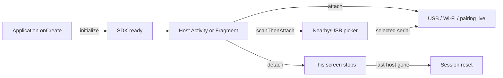

<p align="center">
  
</p>

<p align="center">
  <strong>PROVISIONER JATT SDK</strong><br/>
  <em>USB + wireless ADB provisioning. Your screens. Our connection.</em>
</p>

<p align="center">
  
  
  
  
</p>

<p align="center">
  Plug a device in. Pair over Wi-Fi. Push a DPC.<br/>
  The host app keeps every Activity and Fragment. The SDK owns ADB.
</p>

---

## What this SDK already does

You do **not** build these in the host app.

| Built in | You never write |
| --- | --- |
| USB ADB + Android 11+ wireless TLS ADB | Connection state machines |
| `UsbAttachedReceiver` + device filter | `USB_DEVICE_ATTACHED` on your Activity |
| USB permission + nearby Wi-Fi / location prompts | Permission plumbing |
| Six-digit wireless pairing overlay | Pairing Activity |
| Serial-locked connected-device dialog | Host progress / DPC UI |
| Auto-connect USB and remembered wireless | Reconnect loops |
| Serial lock, scan, make owner, automate DPC | ADB shell scripts |
| Nearby/USB device picker (`scanThenAttach`) | Host serial-picker UI |

Three verbs after JitPack: **depend → `initialize` → `attach`** (or **`scanThenAttach`** then `attach`).



This guide is for **v1.1.0 after JitPack publish**. The artifact is an AAR plus a POM. Hosts declare **one** dependency. Replace `YOUR_GITHUB_USER` / `YOUR_REPO` with the GitHub coordinates JitPack shows for tag `v1.1.0`.

If the JitPack build page lists a submodule coordinate, use:

`com.github.YOUR_GITHUB_USER.YOUR_REPO:provisioner-jatt:v1.1.0`

Every snippet below has a **Kotlin** tab and a **Java** tab (Gradle Groovy for Java apps). Expand the language you ship.

---

# Implementation — step by step

## Step 1 — Repositories

Open the **root** Gradle settings file. Add Google, Maven Central, and JitPack. JitPack serves this SDK (AAR + POM). The POM pulls the rest.

<details open>
<summary><b>Kotlin</b> — <code>settings.gradle.kts</code></summary>

```kotlin
dependencyResolutionManagement {
    repositoriesMode.set(RepositoriesMode.FAIL_ON_PROJECT_REPOS)
    repositories {
        google()
        mavenCentral()
        maven("https://jitpack.io")
    }
}
```

</details>

<details>
<summary><b>Java</b> — <code>settings.gradle</code></summary>

```groovy
dependencyResolutionManagement {
    repositoriesMode.set(RepositoriesMode.FAIL_ON_PROJECT_REPOS)
    repositories {
        google()
        mavenCentral()
        maven { url 'https://jitpack.io' }
    }
}
```

</details>

---

## Step 2 — One dependency

In the **app** module, set `minSdk` 26 and add a single `implementation`. Do not drop a raw AAR into `app/libs/`. Do not re-declare the SDK’s transitive libraries. If your app already uses Compose for its own UI, keep those lines for the app — they are not required as SDK companions.

<details open>
<summary><b>Kotlin</b> — <code>app/build.gradle.kts</code></summary>

```kotlin
android {
    defaultConfig {
        minSdk = 26
    }
}

dependencies {
    implementation("com.github.YOUR_GITHUB_USER:YOUR_REPO:v1.1.0")
}
```

</details>

<details>
<summary><b>Java</b> — <code>app/build.gradle</code></summary>

```groovy
android {
    defaultConfig {
        minSdk 26
    }
}

dependencies {
    implementation 'com.github.YOUR_GITHUB_USER:YOUR_REPO:v1.1.0'
}
```

</details>

`INTERNET`, USB host, and nearby-network permissions **merge from the AAR**. Do **not** put `USB_DEVICE_ATTACHED` on your Activity — the library receiver owns that filter.

Optional brand mark: copy `example/src/main/res/drawable/logo_provisioner.png` into `app/src/main/res/drawable/` as `logo_provisioner.png` if you want it on the pairing, nearby/USB picker, and connected-device dialogs.

---

## Step 3 — Wake the SDK in `Application`

`initialize` stores options and starts the engine. It does **not** scan, prompt, or pair until a screen calls `attach` or `scanThenAttach`.

Register the `Application` class in the manifest.

<details open>
<summary><b>Kotlin</b></summary>

```kotlin
import android.app.Application
import com.beastblocks.provisionerjattsdk.PairingDialogColors
import com.beastblocks.provisionerjattsdk.ProvisionerJatt
import com.beastblocks.provisionerjattsdk.ProvisionerOptions

class App : Application() {
    override fun onCreate() {
        super.onCreate()
        ProvisionerJatt.initialize(
            this,
            ProvisionerOptions(
                pairingColors = PairingDialogColors(),
                pairingWatermarkResId = R.drawable.logo_provisioner, // omit for none
                showProvisionerDialog = true, // default; pass false to skip
            ),
        )
    }
}
```

```xml
<application
    android:name=".App"
    ... >
```

</details>

<details>
<summary><b>Java</b></summary>

```java
import android.app.Application;
import com.beastblocks.provisionerjattsdk.PairingDialogColors;
import com.beastblocks.provisionerjattsdk.ProvisionerJatt;
import com.beastblocks.provisionerjattsdk.ProvisionerOptions;

public class App extends Application {
    @Override
    public void onCreate() {
        super.onCreate();
        ProvisionerJatt.initialize(
            this,
            new ProvisionerOptions(
                new PairingDialogColors(
                    PairingDialogColors.DEFAULT_BACKGROUND,
                    PairingDialogColors.DEFAULT_SURFACE,
                    PairingDialogColors.DEFAULT_SURFACE_PRESSED,
                    PairingDialogColors.DEFAULT_ACCENT,
                    PairingDialogColors.DEFAULT_ON_ACCENT,
                    PairingDialogColors.DEFAULT_YELLOW,
                    PairingDialogColors.DEFAULT_TEXT_PRIMARY,
                    PairingDialogColors.DEFAULT_TEXT_SECONDARY,
                    PairingDialogColors.DEFAULT_OUTLINE
                ),
                R.drawable.logo_provisioner, // null for none
                null,
                true // showProvisionerDialog; pass false to skip
            )
        );
        // Defaults only: ProvisionerJatt.initialize(this);
    }
}
```

```xml
<application
    android:name=".App"
    ... >
```

</details>

`showProvisionerDialog` defaults to **true**. It only appears when a **serial number** is set, after pairing closes and the device is authorized. The dialog uses the same `pairingColors` (watermark only if you passed one). If automation is off, it lists DPC components.

---

## Step 4 — Attach every provisioning screen

Pairing, permissions, and auto-connect run only on Activities you attach. Use the window the user is looking at — the SDK never starts its own Activity.

`attach` requires a `LifecycleOwner`. Activity: pass `this`, `this`. Fragment: pass `requireActivity()` and `this` or `viewLifecycleOwner` / `getViewLifecycleOwner()`. The SDK detaches automatically on that lifecycle’s **destroy** if you never call `detach`.

Call `attach` after `super.onCreate()` / `super.onViewCreated()`. To let the user pick a serial from live USB and nearby wireless devices instead of passing one, use `scanThenAttach` (Step 5) — it is not part of the attach overlay and ends by calling `attach` with that serial.

<details open>
<summary><b>Kotlin</b></summary>

```kotlin
import android.os.Bundle
import androidx.activity.ComponentActivity
import com.beastblocks.provisionerjattsdk.ProvisionerClient
import com.beastblocks.provisionerjattsdk.ProvisionerJatt

class ProvisionerActivity : ComponentActivity() {
    private lateinit var client: ProvisionerClient

    override fun onCreate(savedInstanceState: Bundle?) {
        super.onCreate(savedInstanceState)
        client = ProvisionerJatt.attach(this, this)
        // With serial lock first:
        // client = ProvisionerJatt.attach(this, this, "SERIAL")
    }

    override fun onDestroy() {
        if (::client.isInitialized) client.detach(this)
        super.onDestroy()
    }
}
```

</details>

<details>
<summary><b>Java</b></summary>

```java
import android.os.Bundle;
import androidx.annotation.Nullable;
import androidx.appcompat.app.AppCompatActivity;
import com.beastblocks.provisionerjattsdk.ProvisionerClient;
import com.beastblocks.provisionerjattsdk.ProvisionerJatt;

public class ProvisionerActivity extends AppCompatActivity {
    private ProvisionerClient client;

    @Override
    protected void onCreate(@Nullable Bundle savedInstanceState) {
        super.onCreate(savedInstanceState);
        client = ProvisionerJatt.attach(this, this);
        // With serial lock first:
        // client = ProvisionerJatt.attach(this, this, "SERIAL");
    }

    @Override
    protected void onDestroy() {
        if (client != null) {
            client.detach(this);
        }
        super.onDestroy();
    }
}
```

</details>

| Call | When |
| --- | --- |
| `attach(activity, lifecycleOwner)` | Required for the live session. Activity: `attach(this, this)`. Fragment: `attach(requireActivity(), viewLifecycleOwner)`. |
| `attach(activity, lifecycleOwner, serial)` | Same, after saving that serial |
| `scanThenAttach(activity, lifecycleOwner)` | Optional, **before** `attach`. Picker dialog, then `attach` with the selected serial. Same Activity / LifecycleOwner rules as `attach`. |
| `setSerial(serial)` | Set or replace the serial lock at any time |
| `detach(activity)` | Optional: stop this screen before destroy. Destroy detaches automatically. Always pass the **Activity**, not a Fragment context. |
| `resetSession()` | Drop live ADB and start clean without leaving |
| `isSessionActive()` | Whether a host is currently live |

Switching between attached screens does **not** re-`initialize`. Detach removes only that window. When the last host is gone, the live session resets.

After `initialize` / `attach`, anywhere on a host screen:

<details open>
<summary><b>Kotlin</b></summary>

```kotlin
val client = ProvisionerJatt.get()
```

</details>

<details>
<summary><b>Java</b></summary>

```java
ProvisionerClient client = ProvisionerJatt.get();
```

</details>

---

## Step 5 — Pick a serial from Nearby/USB (`scanThenAttach`)

Use this when the host should **not** type or hard-code a serial. It is an addition to `attach`, not a replacement. The current attach flow stays as it is.

`scanThenAttach` runs **before** `attach`. It is **not** part of the attach / detach overlay. The library shows a dialog titled **Nearby/USB Plugged Devices**. It uses the same `pairingColors` and `pairingWatermarkResId` as the pairing and connected-device dialogs (omit either to keep the default brand). Searching starts when that dialog opens and stops when it closes.

The list is live USB **and** wireless devices: rows appear, update, and disappear as devices are plugged, discovered, connected, disconnected, or leave the network. Selecting a row whose serial is known passes that serial to `attach`; the existing host flow then continues (pairing, auto-connect, automation, connected-device dialog). Closing without a selection does not attach.

The picker does **not** pair, open ADB, or provision. USB permission is requested the same way as today — only when a USB device is attached and the host does not already have it. A USB row without permission stays in the list until the user allows it and a serial is available.

Call after `super.onCreate()` / `super.onViewCreated()`, with the same Activity and `LifecycleOwner` you would pass to `attach`.

<details open>
<summary><b>Kotlin</b></summary>

```kotlin
import android.os.Bundle
import androidx.activity.ComponentActivity
import com.beastblocks.provisionerjattsdk.ProvisionerClient
import com.beastblocks.provisionerjattsdk.ProvisionerJatt

class ProvisionerActivity : ComponentActivity() {
    private lateinit var client: ProvisionerClient

    override fun onCreate(savedInstanceState: Bundle?) {
        super.onCreate(savedInstanceState)
        // Instead of attach(this, this) or attach(this, this, "SERIAL"):
        client = ProvisionerJatt.scanThenAttach(this, this)
    }

    override fun onDestroy() {
        if (::client.isInitialized) client.detach(this)
        super.onDestroy()
    }
}
```

Or keep `attach` as the default and offer the picker from a button:

```kotlin
client.scanThenAttach(this, this)
```

</details>

<details>
<summary><b>Java</b></summary>

```java
import android.os.Bundle;
import androidx.annotation.Nullable;
import androidx.appcompat.app.AppCompatActivity;
import com.beastblocks.provisionerjattsdk.ProvisionerClient;
import com.beastblocks.provisionerjattsdk.ProvisionerJatt;

public class ProvisionerActivity extends AppCompatActivity {
    private ProvisionerClient client;

    @Override
    protected void onCreate(@Nullable Bundle savedInstanceState) {
        super.onCreate(savedInstanceState);
        // Instead of attach(this, this) or attach(this, this, "SERIAL"):
        client = ProvisionerJatt.scanThenAttach(this, this);
    }

    @Override
    protected void onDestroy() {
        if (client != null) {
            client.detach(this);
        }
        super.onDestroy();
    }
}
```

Or keep `attach` as the default and offer the picker from a button:

```java
client.scanThenAttach(this, this);
```

</details>

Fragment: `ProvisionerJatt.scanThenAttach(requireActivity(), viewLifecycleOwner)` / `getViewLifecycleOwner()`. Same three host scenarios as `attach` — only one fragment should drive the picker at a time.

Do **not** call `scanThenAttach` as part of the attached window’s pairing overlay. After a device is selected, `attach` owns discovery, pairing, and provisioning.

---

## Step 6 — Automate, or just listen

Package + URL and serial are **independent**.

**Hands-off DPC install** (valid package name and HTTPS APK URL):

<details open>
<summary><b>Kotlin</b></summary>

```kotlin
client.setAutomation(
    packageName = "com.example.dpc",
    downloadUrl = "https://example.com/dpc.apk",
)
client.clearAutomation() // package + URL only
```

</details>

<details>
<summary><b>Java</b></summary>

```java
client.setAutomation("com.example.dpc", "https://example.com/dpc.apk");
client.clearAutomation(); // package + URL only
```

</details>

`setAutomation` returns `false` if package or URL is missing/invalid. It does not change serial.

**Serial lock** (optional, any time — including before `attach`). To choose the serial from a live USB + nearby list instead of passing a string, use `scanThenAttach` (Step 5).

<details open>
<summary><b>Kotlin</b></summary>

```kotlin
ProvisionerJatt.attach(this, this, serialNumber = "SERIAL")
client.setSerial("SERIAL")
client.clearSerial()
client.clearAutomationAndSerial()
```

</details>

<details>
<summary><b>Java</b></summary>

```java
ProvisionerJatt.attach(this, this, "SERIAL");
client.setSerial("SERIAL");
client.clearSerial();
client.clearAutomationAndSerial();
```

</details>

When a serial is set, the library lists, pairs, auto-connects, and disconnects others to match it — even with no package/URL. Auto-provision still only runs when package + URL are set, and then only on that serial.

**Optional lists** (skip these if the host has no device UI):

<details open>
<summary><b>Kotlin</b></summary>

```kotlin
lifecycleScope.launch {
    client.discoveredDevices.collect { /* pending */ }
}
lifecycleScope.launch {
    client.connectedDevices.collect { /* ready */ }
}
```

</details>

<details>
<summary><b>Java</b></summary>

```java
client.getDiscoveredDevices().getValue(); // snapshot
client.getConnectedDevices().getValue();
```

</details>

Automation and pairing still run if you never collect a flow.

**Optional manual actions** (only if you draw device cards):

<details open>
<summary><b>Kotlin</b></summary>

```kotlin
client.scan(deviceId)
client.makeDeviceOwner(deviceId, component)
client.removeOwner(deviceId, component)
client.retryProvisioning(deviceId)
client.disconnectWireless(deviceId)
```

</details>

<details>
<summary><b>Java</b></summary>

```java
client.scan(deviceId);
client.makeDeviceOwner(deviceId, component);
client.removeOwner(deviceId, component);
client.retryProvisioning(deviceId);
client.disconnectWireless(deviceId);
```

</details>

---

## Step 7 — Pairing overlay (optional look)

**Default:** the library draws the six-digit dialog on the attached host Activity. Pass `pairingWatermarkResId` for the Provisioner mark. Override `pairingColors` if you want different orange / yellow / black.

**Your own UI:** set `pairingCodeHandler`. The library will not show its dialog. Submit from yours:

<details open>
<summary><b>Kotlin</b></summary>

```kotlin
ProvisionerJatt.initialize(
    this,
    ProvisionerOptions(
        pairingCodeHandler = object : PairingCodeHandler {
            override fun onPairingRequired(session: PairingSession) {
                // show your UI; update in place if this fires again
                session.submit("123456")
                session.dismiss()
            }
            override fun onPairingClosed() { /* hide your UI */ }
        },
    ),
)
```

Or `client.submitPairingCode("123456")` / `client.dismissPairing()`.

</details>

<details>
<summary><b>Java</b></summary>

```java
ProvisionerJatt.initialize(
    this,
    new ProvisionerOptions(
        new PairingDialogColors(
            PairingDialogColors.DEFAULT_BACKGROUND,
            PairingDialogColors.DEFAULT_SURFACE,
            PairingDialogColors.DEFAULT_SURFACE_PRESSED,
            PairingDialogColors.DEFAULT_ACCENT,
            PairingDialogColors.DEFAULT_ON_ACCENT,
            PairingDialogColors.DEFAULT_YELLOW,
            PairingDialogColors.DEFAULT_TEXT_PRIMARY,
            PairingDialogColors.DEFAULT_TEXT_SECONDARY,
            PairingDialogColors.DEFAULT_OUTLINE
        ),
        null,
        new PairingCodeHandler() {
            @Override
            public void onPairingRequired(PairingSession session) {
                session.getSubmit().invoke("123456");
                session.getDismiss().invoke();
            }

            @Override
            public void onPairingClosed() { /* hide your UI */ }
        },
        true
    )
);
```

Or `client.submitPairingCode("123456")` / `client.dismissPairing()`.

</details>

---

# Fragments — three host scenarios

`attach` still needs the **Activity** (`requireActivity()`), not a fragment `Context`. Pass the **fragment** (or `viewLifecycleOwner`) as `LifecycleOwner` so destroy of the fragment can auto-detach.

Only **one** fragment should attach at a time. Hosts are keyed by Activity. The first `detach(activity)` drops that window even if another fragment still wanted it.

---

## Scenario 1 — One fragment inside an activity

When the fragment appears, attach. When it is destroyed, detach. If you skip `detach`, the fragment `LifecycleOwner` still unbinds on destroy. If you passed the **activity** as owner instead, the session stays live until the activity is destroyed.

<details open>
<summary><b>Kotlin</b></summary>

```kotlin
import android.os.Bundle
import android.view.View
import androidx.fragment.app.Fragment
import com.beastblocks.provisionerjattsdk.ProvisionerClient
import com.beastblocks.provisionerjattsdk.ProvisionerJatt

class ProvisionerFragment : Fragment(R.layout.fragment_provisioner) {
    private var client: ProvisionerClient? = null

    override fun onViewCreated(view: View, savedInstanceState: Bundle?) {
        super.onViewCreated(view, savedInstanceState)
        client = ProvisionerJatt.attach(requireActivity(), viewLifecycleOwner)
    }

    override fun onDestroyView() {
        ProvisionerJatt.detach(requireActivity())
        client = null
        super.onDestroyView()
    }
}
```

</details>

<details>
<summary><b>Java</b></summary>

```java
import android.os.Bundle;
import android.view.View;
import androidx.annotation.NonNull;
import androidx.annotation.Nullable;
import androidx.fragment.app.Fragment;
import com.beastblocks.provisionerjattsdk.ProvisionerClient;
import com.beastblocks.provisionerjattsdk.ProvisionerJatt;

public class ProvisionerFragment extends Fragment {
    private ProvisionerClient client;

    public ProvisionerFragment() {
        super(R.layout.fragment_provisioner);
    }

    @Override
    public void onViewCreated(@NonNull View view, @Nullable Bundle savedInstanceState) {
        super.onViewCreated(view, savedInstanceState);
        client = ProvisionerJatt.attach(requireActivity(), getViewLifecycleOwner());
    }

    @Override
    public void onDestroyView() {
        ProvisionerJatt.detach(requireActivity());
        client = null;
        super.onDestroyView();
    }
}
```

</details>

Rotation recreates the activity. The new fragment must `attach` again in `onViewCreated`.

---

## Scenario 2 — Fragments stacked (`hide` / `show`)

Only the provisioner fragment attaches. Use `onHiddenChanged` for `hide()` / `show()`. It is **not** called the first time the fragment is shown — still attach on first `onResume` when `isHidden` is false.

`onHiddenChanged` does **not** run for `replace()` / `remove()`. Those go through pause/destroy — `onDestroyView` still detaches.

<details open>
<summary><b>Kotlin</b></summary>

```kotlin
class StackedProvisionerFragment : Fragment(R.layout.fragment_provisioner) {
    private var client: ProvisionerClient? = null

    private fun bind() {
        client = ProvisionerJatt.attach(requireActivity(), viewLifecycleOwner)
    }

    private fun unbind() {
        ProvisionerJatt.detach(requireActivity())
        client = null
    }

    override fun onResume() {
        super.onResume()
        if (!isHidden) bind()
    }

    override fun onHiddenChanged(hidden: Boolean) {
        super.onHiddenChanged(hidden)
        if (hidden) unbind() else bind()
    }

    override fun onDestroyView() {
        unbind()
        super.onDestroyView()
    }
}
```

</details>

<details>
<summary><b>Java</b></summary>

```java
public class StackedProvisionerFragment extends Fragment {
    private ProvisionerClient client;

    public StackedProvisionerFragment() {
        super(R.layout.fragment_provisioner);
    }

    private void bind() {
        client = ProvisionerJatt.attach(requireActivity(), getViewLifecycleOwner());
    }

    private void unbind() {
        ProvisionerJatt.detach(requireActivity());
        client = null;
    }

    @Override
    public void onResume() {
        super.onResume();
        if (!isHidden()) bind();
    }

    @Override
    public void onHiddenChanged(boolean hidden) {
        super.onHiddenChanged(hidden);
        if (hidden) unbind();
        else bind();
    }

    @Override
    public void onDestroyView() {
        unbind();
        super.onDestroyView();
    }
}
```

</details>

---

## Scenario 3 — ViewPager / ViewPager2

Attach only in the **one** provisioner page. Use **`onResume` / `onPause`**. ViewPager2 keeps only the current page `RESUMED`, so swipe away detaches and swipe back attaches again.

Do **not** use `onHiddenChanged` (ViewPager does not `hide()` pages). Do **not** use `setUserVisibleHint` (deprecated; ViewPager2 never calls it).

Old ViewPager **without** `BEHAVIOR_RESUME_ONLY_CURRENT_FRAGMENT` can keep offscreen pages resumed, so `onPause` may not run on swipe. Prefer ViewPager2, or that behavior flag.

<details open>
<summary><b>Kotlin</b></summary>

```kotlin
class PagerProvisionerFragment : Fragment(R.layout.fragment_provisioner) {
    private var client: ProvisionerClient? = null

    override fun onResume() {
        super.onResume()
        client = ProvisionerJatt.attach(requireActivity(), viewLifecycleOwner)
    }

    override fun onPause() {
        ProvisionerJatt.detach(requireActivity())
        client = null
        super.onPause()
    }
}
```

</details>

<details>
<summary><b>Java</b></summary>

```java
public class PagerProvisionerFragment extends Fragment {
    private ProvisionerClient client;

    public PagerProvisionerFragment() {
        super(R.layout.fragment_provisioner);
    }

    @Override
    public void onResume() {
        super.onResume();
        client = ProvisionerJatt.attach(requireActivity(), getViewLifecycleOwner());
    }

    @Override
    public void onPause() {
        ProvisionerJatt.detach(requireActivity());
        client = null;
        super.onPause();
    }
}
```

</details>

---

## Host checklist

- [ ] `minSdk` 26+
- [ ] JitPack `implementation("com.github.YOUR_GITHUB_USER:YOUR_REPO:v1.1.0")` — one line, POM included
- [ ] `google()`, `mavenCentral()`, `jitpack.io`
- [ ] `Application` registered, `initialize` in `onCreate`
- [ ] `attach(activity, lifecycleOwner)` **or** `scanThenAttach(activity, lifecycleOwner)` on every provisioning Activity or Fragment
- [ ] **No** `USB_DEVICE_ATTACHED` on your Activity
- [ ] Physical USB host and/or Android 11+ wireless debugging on the target device

The first USB attach still needs the user to tap **Allow** on the device. Wireless still needs Wireless debugging + the six-digit code. The SDK does not bypass ADB authorization or Android enterprise policy.

---

<p align="center">
  
  <br/>
  <sub>Provisioner Jatt SDK · v1.1.0 · <code>com.beastblocks.provisionerjattsdk</code></sub>
</p>
