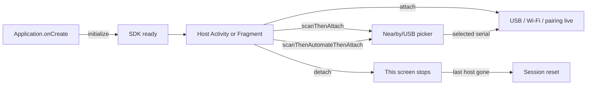

<p align="center">
  
</p>

<p align="center">
  <strong>PROVISIONER JATT SDK</strong><br/>
  <em>USB + wireless ADB provisioning. Your screens. Our connection.</em>
</p>

<p align="center">
  
  
  
  
  
</p>

<p align="center">
  Plug a device in. Pair over Wi-Fi. Push a DPC.<br/>
  The host app keeps every Activity and Fragment. The SDK owns ADB.
</p>

---

## What this SDK already does

You do **not** build these in the host app.

| Built in | You never write |
| --- | --- |
| USB ADB + Android 11+ wireless TLS ADB | Connection state machines |
| `UsbAttachedReceiver` + device filter | `USB_DEVICE_ATTACHED` on your Activity |
| USB permission + nearby Wi-Fi / location prompts | Permission plumbing |
| Six-digit wireless pairing overlay | Pairing Activity |
| Serial-locked connected-device dialog | Host progress / DPC UI |
| Screen stays on while a host is attached | Keep-awake / wake lock |
| Auto-connect USB; 20s host-side wireless reconnect | Reconnect loops |
| Serial lock, scan, make owner, automate DPC | ADB shell scripts |
| Nearby/USB device picker (`scanThenAttach`) | Host serial-picker UI |
| Scan, set DPC package+URL, then attach (`scanThenAutomateThenAttach`) | Host serial picker + automation wiring |

Implementation path after JitPack: **depend → `initialize` → attach a host screen**.



Every snippet is **Kotlin**, then **Java**. The filled pill matches the block under it.

## Changelog

### v1.2.0

Compared with **v1.1.1**:

- Keep-awake while a host is attached (`FLAG_KEEP_SCREEN_ON` + wake lock); released on `detach`, destroy, or the scan picker.
- Host-side wireless reconnect is bounded to **20 seconds**, with a countdown toast when a pairing advertisement is visible. A drop from the pairing device, `disconnectWireless`, or dialog **Disconnect** forgets that peer immediately.
- `scanThenAutomateThenAttach` picks a serial, stores package+URL, then attaches. Both automation fields are required.
- `enableSingleModeAutomationDialog`, `enableRememberAndReconnect`, and `enableReconnectProgressToast` on `ProvisionerOptions` (all default true).
- `ProvisionerJattListener` dialog and status callbacks; vibration, confirmation, and toast flags on `initialize`.
- Optional `scanDialogTitle` on `scanThenAttach`; connected-device dialog **Disconnect** closes the session and forgets wireless remembrance.
- User-facing copy, colors, spacing, integers, and option defaults live in `res/values` and are referenced from the SDK.

Use `implementation("com.github.jatinsinghsatija:Provisioner-Jatt-SDK:v1.2.0")`.

---

# Implementation

This section is what you must wire. Custom pairing modes, overlays, and theming are **features** later — not extra steps.

## SDK implementation

Open the **root** Gradle settings file. Add Google, Maven Central, and JitPack. JitPack serves this SDK (AAR + POM). The POM pulls the rest.

<p>
  
  
</p>

<p><sub>SETTINGS · SETTINGS.GRADLE.KTS</sub></p>

```kotlin
dependencyResolutionManagement {
    repositoriesMode.set(RepositoriesMode.FAIL_ON_PROJECT_REPOS)
    repositories {
        google()
        mavenCentral()
        maven("https://jitpack.io")
    }
}
```

<p>
  
  
</p>

<p><sub>SETTINGS · SETTINGS.GRADLE</sub></p>

```groovy
dependencyResolutionManagement {
    repositoriesMode.set(RepositoriesMode.FAIL_ON_PROJECT_REPOS)
    repositories {
        google()
        mavenCentral()
        maven { url 'https://jitpack.io' }
    }
}
```

In the **app** module, set `minSdk` 26. The SDK’s minimum supported Gradle is **8.13**. Add a single `implementation`. Do not drop a raw AAR into `app/libs/`. Do not re-declare the SDK’s transitive libraries. If your app already uses Compose for its own UI, keep those lines for the app — they are not required as SDK companions.

<p>
  
  
</p>

<p><sub>APP · BUILD.GRADLE.KTS</sub></p>

```kotlin
android {
    defaultConfig {
        minSdk = 26 // Gradle 8.13+
    }
}

dependencies {
    implementation("com.github.jatinsinghsatija:Provisioner-Jatt-SDK:v1.2.0")
}
```

<p>
  
  
</p>

<p><sub>APP · BUILD.GRADLE</sub></p>

```groovy
android {
    defaultConfig {
        minSdk 26 // Gradle 8.13+
    }
}

dependencies {
    implementation 'com.github.jatinsinghsatija:Provisioner-Jatt-SDK:v1.2.0'
}
```

`INTERNET`, USB host, and nearby-network permissions **merge from the AAR**. Do **not** put `USB_DEVICE_ATTACHED` on your Activity — the library receiver owns that filter.

Optional brand mark: copy `example/src/main/res/drawable/logo_provisioner.png` into `app/src/main/res/drawable/` as `logo_provisioner.png` if you want it on the pairing, nearby/USB picker, and connected-device dialogs.

---

## Initialize in `Application`

`initialize` stores options and starts the engine. It does **not** scan, prompt, or pair until a screen calls `attach`, `scanThenAttach`, or `scanThenAutomateThenAttach`.

Register the `Application` class in the manifest. `ProvisionerJatt.initialize(this)` is enough for every default. The block below lists **every** `ProvisionerOptions` field you can pass.

<p>
  
  
</p>

<p><sub>APPLICATION · APP.KT</sub></p>

```kotlin
import android.app.Application
import com.beastblocks.provisionerjattsdk.PairingDialogColors
import com.beastblocks.provisionerjattsdk.ProvisionerJatt
import com.beastblocks.provisionerjattsdk.ProvisionerOptions

class App : Application() {
    override fun onCreate() {
        super.onCreate()
        ProvisionerJatt.initialize(
            this,
            ProvisionerOptions(
                // Dialog / overlay palette. Default: brand white / orange / yellow / black
                // from colors.xml (or PairingDialogColors.from(this)).
                pairingColors = PairingDialogColors(),
                // Watermark on pairing, scan picker, and connected-device dialogs. Default: null (none).
                pairingWatermarkResId = R.drawable.logo_provisioner,
                // Your own six-digit UI instead of the SDK dialog. Default: null (SDK draws the overlay).
                pairingCodeHandler = null,
                // After a serial-locked device is authorized, show the connected-device / DPC dialog.
                // Default: true. Has no effect unless a serial is set.
                showProvisionerDialog = true,
                // Haptics on dialogs, scan-row select, pairing digits, automation steps. Default: true.
                enableVibrationFeedback = true,
                // Ask before Confirm Device, Pair, and Disconnect. Default: true.
                enableConfirmation = true,
                // In-app alerts after scan confirm and after pairing plus connection. Default: true.
                enableToastAlerts = true,
                // Same connected-device dialog gate as showProvisionerDialog, including when a serial is locked.
                // Default: true. Pass false to never show that dialog.
                enableSingleModeAutomationDialog = true,
                // Persist paired wireless peers and auto-reconnect 20s after a host-side drop. Default: true.
                enableRememberAndReconnect = true,
                // Sticky 20s reconnect countdown toast while a pairing advertisement is visible. Default: true.
                enableReconnectProgressToast = true,
            ),
        )
        // Resource defaults only: ProvisionerJatt.initialize(this)
        // or ProvisionerJatt.initialize(this, ProvisionerOptions.from(this))
    }
}
```

```xml
<application
    android:name=".App"
    ... >
```

<p>
  
  
</p>

<p><sub>APPLICATION · APP.JAVA</sub></p>

```java
import android.app.Application;
import com.beastblocks.provisionerjattsdk.PairingDialogColors;
import com.beastblocks.provisionerjattsdk.ProvisionerJatt;
import com.beastblocks.provisionerjattsdk.ProvisionerOptions;

public class App extends Application {
    @Override
    public void onCreate() {
        super.onCreate();
        ProvisionerJatt.initialize(
            this,
            new ProvisionerOptions(
                PairingDialogColors.from(this), // palette; default brand colors from colors.xml
                R.drawable.logo_provisioner,   // watermark; null = none
                null,                          // pairingCodeHandler; null = SDK overlay
                true,                          // showProvisionerDialog; default true
                true,                          // enableVibrationFeedback; default true
                true,                          // enableConfirmation; default true
                true,                          // enableToastAlerts; default true
                true,                          // enableSingleModeAutomationDialog; default true
                true,                          // enableRememberAndReconnect; default true
                true                           // enableReconnectProgressToast; default true
            )
        );
        // Defaults only: ProvisionerJatt.initialize(this);
    }
}
```

```xml
<application
    android:name=".App"
    ... >
```

| Parameter | Default | Purpose |
| --- | --- | --- |
| `pairingColors` | Brand colors from `colors.xml` | Tints pairing, scan picker, confirmation, connected-device UI, toasts |
| `pairingWatermarkResId` | `null` | Optional drawable behind those dialogs |
| `pairingCodeHandler` | `null` | If set, the SDK does not draw its pairing dialog — you submit the code |
| `showProvisionerDialog` | `true` | Connected-device / DPC overlay after a **serial-locked** device is authorized |
| `enableVibrationFeedback` | `true` | Haptic pulse on dialogs, scan select, pairing digits, automation steps |
| `enableConfirmation` | `true` | Confirm Device, Pair, and Disconnect ask first |
| `enableToastAlerts` | `true` | Alerts after scan confirm and after pairing plus connection |
| `enableSingleModeAutomationDialog` | `true` | Same connected-device dialog; `false` hides it even with a serial |
| `enableRememberAndReconnect` | `true` | Remember wireless peers; 20s reconnect only after a **host-side** drop |
| `enableReconnectProgressToast` | `true` | Countdown toast during that 20s window if a pairing advertisement is open |

Calling `initialize` again later only **updates options**. It does not re-scan or re-pair.

---

## Attach SDK

Pairing, permissions, and auto-connect run only on Activities you attach. The SDK never starts its own Activity. Use the window the user is looking at.

`attach` / `scanThenAttach` / `scanThenAutomateThenAttach` all need:

- **Activity** — the window that hosts overlays (`this` on an Activity, `requireActivity()` on a Fragment)
- **LifecycleOwner** — Activity: `this`. Fragment: `this` or `viewLifecycleOwner` / `getViewLifecycleOwner()`

> **Note:** These functions can be called **any time** from an Activity or Fragment (after `super.onCreate()` / `super.onViewCreated()`, from a button, after you save a serial, and so on). You do not have to call them only once in `onCreate`. Switching attached screens does **not** require `initialize` again.

While a host is attached, that screen is kept on. The wake lock is released on `detach`, when the host is destroyed, or when the scan picker temporarily drops the host (it is acquired again after a confirmed selection calls `attach`).

### `attach` — open the live session

Use this when the host should start USB + wireless discovery, pairing overlay, and auto-connect immediately.

<p>
  
  
</p>

<p><sub>ACTIVITY · PROVISIONERACTIVITY.KT</sub></p>

```kotlin
import android.os.Bundle
import androidx.activity.ComponentActivity
import com.beastblocks.provisionerjattsdk.ProvisionerClient
import com.beastblocks.provisionerjattsdk.ProvisionerJatt
import com.beastblocks.provisionerjattsdk.ProvisionerJattListener

class ProvisionerActivity : ComponentActivity() {
    private lateinit var client: ProvisionerClient

    override fun onCreate(savedInstanceState: Bundle?) {
        super.onCreate(savedInstanceState)
        // Live session on this window. No serial lock → multi-device pairing.
        client = ProvisionerJatt.attach(this, this)

        // Serial lock first, then attach. Listing / pairing / auto-connect use that serial.
        // client = ProvisionerJatt.attach(this, this, "SERIAL")

        // Same, with dialog / pair / provision callbacks until detach.
        // client = ProvisionerJatt.attach(this, this, "SERIAL", listener)
    }
}
```

<p>
  
  
</p>

<p><sub>ACTIVITY · PROVISIONERACTIVITY.JAVA</sub></p>

```java
import android.os.Bundle;
import androidx.annotation.Nullable;
import androidx.appcompat.app.AppCompatActivity;
import com.beastblocks.provisionerjattsdk.ProvisionerClient;
import com.beastblocks.provisionerjattsdk.ProvisionerJatt;

public class ProvisionerActivity extends AppCompatActivity {
    private ProvisionerClient client;

    @Override
    protected void onCreate(@Nullable Bundle savedInstanceState) {
        super.onCreate(savedInstanceState);
        client = ProvisionerJatt.attach(this, this);
        // client = ProvisionerJatt.attach(this, this, "SERIAL");
        // client = ProvisionerJatt.attach(this, this, "SERIAL", listener);
    }
}
```

| Declaration | Purpose |
| --- | --- |
| `attach(activity, lifecycleOwner)` | Start the live session on this window. No serial → any eligible USB / wireless device |
| `attach(activity, lifecycleOwner, serial)` | Save that serial, then attach. Single-device lock from the first frame |
| `attach(activity, lifecycleOwner, serial, listener)` | Same, and bind `ProvisionerJattListener` until `detach` |

Fragment: `ProvisionerJatt.attach(requireActivity(), viewLifecycleOwner)`.

### `scanThenAttach` — pick a serial, then attach

Use this when the host should **not** type or hard-code a serial. It is an addition to `attach`, not a replacement.

It runs **before** `attach`. It is **not** the pairing overlay. The library shows **Nearby/USB Plugged Devices** (override with `scanDialogTitle`). Searching starts when the dialog opens and stops when it closes. Confirming a row whose serial is known calls `attach` with that serial. Closing without a selection does not attach.

The picker does **not** pair, open ADB, or provision.

<p>
  
  
</p>

<p><sub>ACTIVITY · SCANTHENATTACH</sub></p>

```kotlin
// Full screen: picker instead of attach(this, this)
client = ProvisionerJatt.scanThenAttach(this, this)

// Custom title
client = ProvisionerJatt.scanThenAttach(this, this, "Choose a device")

// From a button on an already-created client
client.scanThenAttach(this, this)

// With listener
client = ProvisionerJatt.scanThenAttach(this, this, listener, "Choose a device")
```

<p>
  
  
</p>

<p><sub>ACTIVITY · SCANTHENATTACH</sub></p>

```java
client = ProvisionerJatt.scanThenAttach(this, this);
client = ProvisionerJatt.scanThenAttach(this, this, "Choose a device");
client.scanThenAttach(this, this);
client = ProvisionerJatt.scanThenAttach(this, this, listener, "Choose a device");
```

| Declaration | Purpose |
| --- | --- |
| `scanThenAttach(activity, lifecycleOwner)` | Picker, then `attach` with the selected serial |
| `scanThenAttach(activity, lifecycleOwner, scanDialogTitle)` | Same, custom dialog title |
| `scanThenAttach(activity, lifecycleOwner, listener)` | Same, bind listener until `detach` |
| `scanThenAttach(activity, lifecycleOwner, listener, scanDialogTitle)` | Title + listener |

### `scanThenAutomateThenAttach` — pick a serial, store DPC, then attach

Same picker as `scanThenAttach`. After the serial is saved it also stores **package name + HTTPS APK URL**, then `attach`. Both automation fields are **required**. Auto-provision runs only on that serial once the device is authorized.

<p>
  
  
</p>

<p><sub>ACTIVITY · SCANTHENAUTOMATETHENATTACH</sub></p>

```kotlin
client = ProvisionerJatt.scanThenAutomateThenAttach(
    this,
    this,
    packageName = "com.example.dpc",
    downloadUrl = "https://example.com/dpc.apk",
)
// Optional listener / title:
// ProvisionerJatt.scanThenAutomateThenAttach(this, this, pkg, url, listener, "Choose a device")
```

<p>
  
  
</p>

<p><sub>ACTIVITY · SCANTHENAUTOMATETHENATTACH</sub></p>

```java
client = ProvisionerJatt.scanThenAutomateThenAttach(
    this,
    this,
    "com.example.dpc",
    "https://example.com/dpc.apk"
);
// ProvisionerJatt.scanThenAutomateThenAttach(this, this, pkg, url, listener, "Choose a device");
```

| Declaration | Purpose |
| --- | --- |
| `scanThenAutomateThenAttach(activity, lifecycleOwner, packageName, downloadUrl)` | Picker → save serial + DPC package/URL → `attach` |
| `…(…, listener)` | Same, bind listener until `detach` |
| `…(…, listener, scanDialogTitle)` | Same, custom picker title |

After `initialize` / any attach form, anywhere on a host screen:

<p>
  
  
</p>

```kotlin
val client = ProvisionerJatt.get()
```

<p>
  
  
</p>

```java
ProvisionerClient client = ProvisionerJatt.get();
```

---

## Detach and `LifecycleOwner`

`detach` removes **this Activity** as a host window. Pairing, permission prompts, and auto-connect no longer use it. The keep-screen-on wake lock for that window is released. If it was the last host, the live ADB session resets.

Destroy also detaches automatically when you passed a `LifecycleOwner`. You still may call `detach` yourself (for example in `onDestroy` / `onDestroyView` / `onPause` for a pager page).

Always pass the **Activity**, not a Fragment context: `detach(this)` or `ProvisionerJatt.detach(requireActivity())`.

| Owner you pass | Auto-detach when |
| --- | --- |
| Activity (`this`, `this`) | Activity `ON_DESTROY` |
| Fragment `viewLifecycleOwner` | Fragment view destroyed (`onDestroyView`) |
| Fragment `this` | Fragment `ON_DESTROY` |

If you pass the **activity** as owner from a fragment, the session stays live until the activity is destroyed — even after the fragment’s view is gone.

<p>
  
  
</p>

<p><sub>ACTIVITY · ONDESTROY</sub></p>

```kotlin
override fun onDestroy() {
    if (::client.isInitialized) client.detach(this)
    super.onDestroy()
}
```

<p>
  
  
</p>

<p><sub>ACTIVITY · ONDESTROY</sub></p>

```java
@Override
protected void onDestroy() {
    if (client != null) {
        client.detach(this);
    }
    super.onDestroy();
}
```

Hosts are keyed by Activity. The first `detach(activity)` drops that window even if another fragment on the same activity still wanted it — only **one** fragment should attach at a time.

`detach` also unbinds `ProvisionerJattListener`.

---

## Exposed functions

All of these hang off `ProvisionerClient` (`ProvisionerJatt.get()`, or the value returned by `attach` / `scanThenAttach`). Comments in the snippets are the contract.

<p>
  
  
</p>

<p><sub>CLIENT · KOTLIN</sub></p>

```kotlin
val client = ProvisionerJatt.get()

// Snapshot of settings + devices + pairing UI state.
val ui = client.state.value

// Every known target (USB + wireless), any connection state.
val all = client.devices.value
// Not yet READY (discovered, connecting, unauthorized, failed, …).
val nearby = client.discoveredDevices.value
// Authorized ADB sessions.
val ready = client.connectedDevices.value

// Current package / URL / serial / mode. Does not start work by itself.
val settings = client.automation()

// Hands-off DPC: valid package + HTTPS APK URL. Independent of serial.
// Returns false if package or URL is missing/invalid. Does not change serial.
client.setAutomation("com.example.dpc", "https://example.com/dpc.apk")
client.clearAutomation()          // package + URL only
client.setSerial("SERIAL")        // lock listing / pairing / auto-connect to this serial
client.clearSerial()
client.clearAutomationAndSerial()

// Manual DPC on a connected device (when you draw your own cards, or retry).
client.scan(deviceId)                                  // list DeviceAdminReceiver components
client.makeDeviceOwner(deviceId, component)            // dpm set-device-owner + launch
client.removeOwner(deviceId, component)                // dpm remove-active-admin (test-only)
client.retryProvisioning(deviceId)                     // re-run automation or make-owner / scan
client.disconnectWireless(deviceId)                    // host disconnect; forgets that wireless peer

// If you drew your own pairing UI (pairingCodeHandler), or to drive the default overlay.
client.submitPairingCode("123456")
client.dismissPairing()

// After the user grants nearby / location permission from your own prompt.
client.onLocalNetworkPermissionGranted()

// Same attach family as ProvisionerJatt.*, from an existing client.
client.attach(this, this)
client.scanThenAttach(this, this)
client.scanThenAutomateThenAttach(this, this, pkg, url)
client.detach(this)

// Drop live ADB and restart discovery if a host is still in front.
client.resetSession()
ProvisionerJatt.isSessionActive()
```

<p>
  
  
</p>

<p><sub>CLIENT · JAVA</sub></p>

```java
ProvisionerClient client = ProvisionerJatt.get();

client.getState().getValue();
client.getDevices().getValue();
client.getDiscoveredDevices().getValue();
client.getConnectedDevices().getValue();
client.automation();

client.setAutomation("com.example.dpc", "https://example.com/dpc.apk");
client.clearAutomation();
client.setSerial("SERIAL");
client.clearSerial();
client.clearAutomationAndSerial();

client.scan(deviceId);
client.makeDeviceOwner(deviceId, component);
client.removeOwner(deviceId, component);
client.retryProvisioning(deviceId);
client.disconnectWireless(deviceId);

client.submitPairingCode("123456");
client.dismissPairing();
client.onLocalNetworkPermissionGranted();

client.attach(this, this);
client.scanThenAttach(this, this);
client.scanThenAutomateThenAttach(this, this, pkg, url);
client.detach(this);
client.resetSession();
ProvisionerJatt.isSessionActive();
```

Kotlin Flow collection (optional — automation and pairing still run if you never collect):

<p>
  
  
</p>

```kotlin
lifecycleScope.launch {
    client.discoveredDevices.collect { /* pending */ }
}
lifecycleScope.launch {
    client.connectedDevices.collect { /* ready */ }
}
```

```java
client.getDiscoveredDevices().getValue(); // snapshot
client.getConnectedDevices().getValue();
```

`ProvisionerJattListener` (optional, bound on attach / scan, cleared on `detach`):

```kotlin
val listener = object : ProvisionerJattListener {
    override fun onNearbyScanDialogInvoked() {}
    override fun onNearbyScanDialogClosed() {}
    override fun onPairingDialogInvoked() {}
    override fun onPairingDialogClosed() {}
    override fun onProvisioningDialogInvoked() {}
    override fun onProvisioningDialogClosed() {}
    override fun onPairStatusUpdate(status: PairStatus) {}
    override fun onProvisioningStatusUpdate(status: ProvisioningStatus) {}
}
```

`PairStatus`: `PAIRING_STARTED` → `PAIRING_ESTABLISHED` → `CONNECTION_STARTED` → `CONNECTION_ESTABLISHED`.

`ProvisioningStatus`: `AUTHENTICATING`, `SCANNING`, `DOWNLOADING_APK`, `SENDING_APK`, `INSTALLING`, `SETTING_DEVICE_OWNER`, `LAUNCHING`, `RETRYING`, `SUCCEEDED`, `FAILED`, `OWNER_REMOVED`.

---

# Fragments — three host scenarios

`attach` still needs the **Activity** (`requireActivity()`), not a fragment `Context`. Pass the **fragment** (or `viewLifecycleOwner`) as `LifecycleOwner` so destroy of the fragment can auto-detach.

Only **one** fragment should attach at a time. Hosts are keyed by Activity. The first `detach(activity)` drops that window even if another fragment still wanted it.

---

## Scenario 1 — One fragment inside an activity

When the fragment appears, attach. When it is destroyed, detach. If you skip `detach`, the fragment `LifecycleOwner` still unbinds on destroy. If you passed the **activity** as owner instead, the session stays live until the activity is destroyed.

<p>
  
  
</p>

<p><sub>FRAGMENT · PROVISIONERFRAGMENT.KT</sub></p>

```kotlin
import android.os.Bundle
import android.view.View
import androidx.fragment.app.Fragment
import com.beastblocks.provisionerjattsdk.ProvisionerClient
import com.beastblocks.provisionerjattsdk.ProvisionerJatt

class ProvisionerFragment : Fragment(R.layout.fragment_provisioner) {
    private var client: ProvisionerClient? = null

    override fun onViewCreated(view: View, savedInstanceState: Bundle?) {
        super.onViewCreated(view, savedInstanceState)
        client = ProvisionerJatt.attach(requireActivity(), viewLifecycleOwner)
    }

    override fun onDestroyView() {
        ProvisionerJatt.detach(requireActivity())
        client = null
        super.onDestroyView()
    }
}
```

<p>
  
  
</p>

<p><sub>FRAGMENT · PROVISIONERFRAGMENT.JAVA</sub></p>

```java
import android.os.Bundle;
import android.view.View;
import androidx.annotation.NonNull;
import androidx.annotation.Nullable;
import androidx.fragment.app.Fragment;
import com.beastblocks.provisionerjattsdk.ProvisionerClient;
import com.beastblocks.provisionerjattsdk.ProvisionerJatt;

public class ProvisionerFragment extends Fragment {
    private ProvisionerClient client;

    public ProvisionerFragment() {
        super(R.layout.fragment_provisioner);
    }

    @Override
    public void onViewCreated(@NonNull View view, @Nullable Bundle savedInstanceState) {
        super.onViewCreated(view, savedInstanceState);
        client = ProvisionerJatt.attach(requireActivity(), getViewLifecycleOwner());
    }

    @Override
    public void onDestroyView() {
        ProvisionerJatt.detach(requireActivity());
        client = null;
        super.onDestroyView();
    }
}
```

Rotation recreates the activity. The new fragment must `attach` again in `onViewCreated`.

---

## Scenario 2 — Fragments stacked (`hide` / `show`)

Only the provisioner fragment attaches. Use `onHiddenChanged` for `hide()` / `show()`. It is **not** called the first time the fragment is shown — still attach on first `onResume` when `isHidden` is false.

`onHiddenChanged` does **not** run for `replace()` / `remove()`. Those go through pause/destroy — `onDestroyView` still detaches.

<p>
  
  
</p>

<p><sub>FRAGMENT · STACKEDPROVISIONERFRAGMENT.KT</sub></p>

```kotlin
class StackedProvisionerFragment : Fragment(R.layout.fragment_provisioner) {
    private var client: ProvisionerClient? = null

    private fun bind() {
        client = ProvisionerJatt.attach(requireActivity(), viewLifecycleOwner)
    }

    private fun unbind() {
        ProvisionerJatt.detach(requireActivity())
        client = null
    }

    override fun onResume() {
        super.onResume()
        if (!isHidden) bind()
    }

    override fun onHiddenChanged(hidden: Boolean) {
        super.onHiddenChanged(hidden)
        if (hidden) unbind() else bind()
    }

    override fun onDestroyView() {
        unbind()
        super.onDestroyView()
    }
}
```

<p>
  
  
</p>

<p><sub>FRAGMENT · STACKEDPROVISIONERFRAGMENT.JAVA</sub></p>

```java
public class StackedProvisionerFragment extends Fragment {
    private ProvisionerClient client;

    public StackedProvisionerFragment() {
        super(R.layout.fragment_provisioner);
    }

    private void bind() {
        client = ProvisionerJatt.attach(requireActivity(), getViewLifecycleOwner());
    }

    private void unbind() {
        ProvisionerJatt.detach(requireActivity());
        client = null;
    }

    @Override
    public void onResume() {
        super.onResume();
        if (!isHidden()) bind();
    }

    @Override
    public void onHiddenChanged(boolean hidden) {
        super.onHiddenChanged(hidden);
        if (hidden) unbind();
        else bind();
    }

    @Override
    public void onDestroyView() {
        unbind();
        super.onDestroyView();
    }
}
```

---

## Scenario 3 — ViewPager / ViewPager2

Attach only in the **one** provisioner page. Use **`onResume` / `onPause`**. ViewPager2 keeps only the current page `RESUMED`, so swipe away detaches and swipe back attaches again.

Do **not** use `onHiddenChanged` (ViewPager does not `hide()` pages). Do **not** use `setUserVisibleHint` (deprecated; ViewPager2 never calls it).

Old ViewPager **without** `BEHAVIOR_RESUME_ONLY_CURRENT_FRAGMENT` can keep offscreen pages resumed, so `onPause` may not run on swipe. Prefer ViewPager2, or that behavior flag.

<p>
  
  
</p>

<p><sub>FRAGMENT · PAGERPROVISIONERFRAGMENT.KT</sub></p>

```kotlin
class PagerProvisionerFragment : Fragment(R.layout.fragment_provisioner) {
    private var client: ProvisionerClient? = null

    override fun onResume() {
        super.onResume()
        client = ProvisionerJatt.attach(requireActivity(), viewLifecycleOwner)
    }

    override fun onPause() {
        ProvisionerJatt.detach(requireActivity())
        client = null
        super.onPause()
    }
}
```

<p>
  
  
</p>

<p><sub>FRAGMENT · PAGERPROVISIONERFRAGMENT.JAVA</sub></p>

```java
public class PagerProvisionerFragment extends Fragment {
    private ProvisionerClient client;

    public PagerProvisionerFragment() {
        super(R.layout.fragment_provisioner);
    }

    @Override
    public void onResume() {
        super.onResume();
        client = ProvisionerJatt.attach(requireActivity(), getViewLifecycleOwner());
    }

    @Override
    public void onPause() {
        ProvisionerJatt.detach(requireActivity());
        client = null;
        super.onPause();
    }
}
```

---

# Features

These are **not** implementation steps. They are how you shape the same `initialize` + attach surface for different products. Mix them. None of them replace `initialize` or a host `attach`.

## Multi pairing mode

**Use when:** the operator may pair whichever nearby phone advertises a pairing code, or plug any USB device.

**How:** `attach(activity, owner)` with **no serial** (and do not call `setSerial`).

**What happens:** USB auto-connects when permission is granted. Wireless pairing advertisements open the six-digit overlay (unless that peer is already pairing, connecting, or READY). Several devices can appear in `discoveredDevices` / `connectedDevices`. The connected-device / DPC overlay stays off because it requires a serial lock.

## Single pairing mode (serial lock)

**Use when:** this host is dedicated to one device (IMEI/serial known, or chosen from the picker).

**How:** `attach(activity, owner, serial)`, or `setSerial` at any time, or confirm a row in `scanThenAttach`.

**What happens:** listing, pairing, and auto-connect follow that serial. Other sessions are disconnected to match it. After pairing closes and ADB is authorized, the connected-device dialog can appear (`showProvisionerDialog` and `enableSingleModeAutomationDialog`). Auto-provision still needs package + URL; without them the dialog lists DPC components for Make / Remove owner.

Clear with `clearSerial()` or `clearAutomationAndSerial()`.

## Overlay automate

**Use when:** after the chosen device is authorized, the SDK should download the DPC APK, install it, set device owner, and launch — without extra host UI.

**How:** `setAutomation(packageName, downloadUrl)` and a **serial**, or one-shot `scanThenAutomateThenAttach(activity, owner, packageName, downloadUrl)`.

**What happens:** package + URL and serial are independent flags. Auto-provision runs only when both automation fields are valid **and** the locked serial is READY. The connected-device dialog shows the live step list (authenticate → scan → download → push → install → owner → launch). `retryProvisioning` re-runs that path.

`setAutomation` returns `false` if the package name or URL is missing/invalid. URL must be HTTPS.

## Pairing criteria (when the overlay opens)

These rules are built in. You do not implement them.

- A pairing-code advertisement while that device is **already pairing, connecting, or READY** does **not** open a second pairing dialog — even if the user reopens Wireless debugging → pairing code on the phone.
- A pairing-code advertisement for a **remembered** peer, after a **host-side** drop, starts the **20s reconnect** window instead of the dialog (if remember/reconnect is on). If a pairing screen is still advertised, the countdown toast is shown. When the timer ends or **RECONNECT** is tapped and the advertisement is still open, the pairing dialog opens.
- A drop **from the pairing device** (it leaves discovery) is forgotten immediately. No 20s reconnect.
- `disconnectWireless` / dialog **Disconnect** also forgets, so the next advertisement can start a fresh pair.
- After a failed 20s attempt the peer is forgotten and can reappear in `discoveredDevices` if it is still advertised.

## Custom pairing overlay

**Use when:** you already have a six-digit screen and do not want the SDK dialog.

**How:** set `pairingCodeHandler` on `initialize`. The library will not show its dialog. Update that UI in place when `onPairingRequired` fires again — do not stack a second sheet.

<p>
  
  
</p>

```kotlin
ProvisionerJatt.initialize(
    this,
    ProvisionerOptions(
        pairingCodeHandler = object : PairingCodeHandler {
            override fun onPairingRequired(session: PairingSession) {
                session.submit("123456")
                session.dismiss()
            }
            override fun onPairingClosed() { /* hide your UI */ }
        },
    ),
)
// Or later: client.submitPairingCode("123456") / client.dismissPairing()
```

```java
// pairingCodeHandler is the third ProvisionerOptions argument.
// From your UI: client.submitPairingCode("123456"); client.dismissPairing();
```

Default look: omit the handler. Pass `pairingWatermarkResId` and/or `pairingColors` (or `PairingDialogColors.from(this)`) to theme the SDK overlay.

## Nearby / USB picker

Covered under **Attach SDK**. Extra behaviour: the list is live USB **and** wireless. Rows appear, update, and disappear as devices are plugged, discovered, connected, or leave. USB permission is requested only for a newly plugged device the host does not already have. A USB row without permission stays until the user allows it and a serial is available. Same `pairingColors` / watermark as other dialogs.

## Keep-awake

While a host is attached, `FLAG_KEEP_SCREEN_ON` plus a wake lock keep that screen on. Released on `detach`, destroy, last-host teardown, or when `scanThenAttach` temporarily drops the host for the picker.

## Remember and reconnect

`enableRememberAndReconnect` (default true): persist previously paired wireless peers. Reconnect is **host-only** and **20 seconds**. Pairing-device drop and SDK disconnect forget immediately. `enableReconnectProgressToast` (default true) shows the countdown when a pairing advertisement is visible during that window.

## Confirmations, haptics, toasts

`enableConfirmation` — Confirm Device, Pair, Disconnect. `enableVibrationFeedback` — dialogs, scan select, pairing digits, automation steps. `enableToastAlerts` — after scan confirm and after pairing plus connection. All default true.

## Host checklist

- [ ] `minSdk` 26+ · Gradle 8.13+
- [ ] JitPack `implementation("com.github.jatinsinghsatija:Provisioner-Jatt-SDK:v1.2.0")` — one line, POM included
- [ ] `google()`, `mavenCentral()`, `jitpack.io`
- [ ] `Application` registered, `initialize` in `onCreate`
- [ ] `attach` **or** `scanThenAttach` / `scanThenAutomateThenAttach` on every provisioning Activity or Fragment
- [ ] **No** `USB_DEVICE_ATTACHED` on your Activity
- [ ] Physical USB host and/or Android 11+ wireless debugging on the target device

The first USB attach still needs the user to tap **Allow** on the device. Wireless still needs Wireless debugging + the six-digit code. The SDK does not bypass ADB authorization or Android enterprise policy.

---

<p align="center">
  
  <br/>
  <sub>Provisioner Jatt SDK · v1.2.0 · <code>com.beastblocks.provisionerjattsdk</code></sub>
</p>
