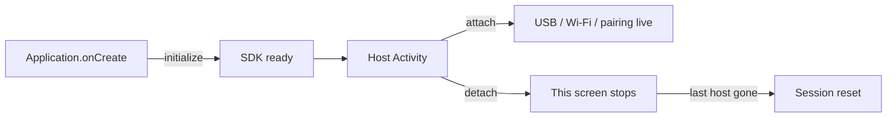

<p align="center">
  
</p>

<p align="center">
  <strong>PROVISIONER JATT SDK</strong><br/>
  <em>USB + wireless ADB provisioning, packed as one drop-in SDK.</em>
</p>

<p align="center">
  
  
  
</p>

<p align="center">
  Plug a device in. Pair over Wi-Fi. Push a DPC.<br/>
  Your app keeps its screens. The SDK owns the hard parts.
</p>

---

## Artifact

|             |                                                           |
| ----------- | --------------------------------------------------------- |
| Version     | **1.0.0**                                                 |
| Dependency  | `com.github.jatinsinghsatija:Provisioner-Jatt-SDK:v1.0.0` |
| Namespace   | `com.beastblocks.provisionerjattsdk`                      |
| Entry point | `ProvisionerJatt`                                         |

---

## What the SDK already does for you

You do **not** implement these in the host app:

| Built in                                         | You never write                        |
| ------------------------------------------------ | -------------------------------------- |
| USB ADB + Android 11+ wireless TLS ADB           | Connection state machines              |
| `UsbAttachedReceiver` + device filter            | `USB_DEVICE_ATTACHED` on your Activity |
| USB permission + nearby Wi-Fi / location prompts | Permission plumbing                    |
| Six-digit wireless pairing overlay               | Pairing Activity                       |
| Auto-connect USB and remembered wireless         | Reconnect loops                        |
| Serial lock, scan, make owner, automate DPC      | ADB shell scripts                      |

Your job is three verbs: **add the dependency → `initialize` → `attach`.**



---

# Integration — five beats

### 1. Add the JitPack repository

`settings.gradle.kts`

```kotlin
dependencyResolutionManagement {
    repositoriesMode.set(RepositoriesMode.FAIL_ON_PROJECT_REPOS)
    repositories {
        google()
        mavenCentral()
        maven("https://jitpack.io")
    }
}
```

Do **not** add `google-services.json` or the Google Services plugin for this SDK. Firebase is initialized inside the SDK.

---

### 2. Add the SDK dependency

`app/build.gradle.kts`

```kotlin
android {
    defaultConfig {
        minSdk = 26
    }
}

dependencies {
    implementation("com.github.jatinsinghsatija:Provisioner-Jatt-SDK:v1.0.0")
}
```

The SDK's required dependencies are resolved through the configured repositories.

`INTERNET`, USB host, and nearby-network permissions **merge from the SDK**. Do not put `USB_DEVICE_ATTACHED` on your Activity — the library receiver owns that filter.

---

### 3. Wake the SDK in `Application`

```kotlin
import com.beastblocks.provisionerjattsdk.ProvisionerJatt
import com.beastblocks.provisionerjattsdk.ProvisionerOptions

class App : Application() {
    override fun onCreate() {
        super.onCreate()
        ProvisionerJatt.initialize(
            this,
            ProvisionerOptions(
                pairingWatermarkResId = R.drawable.logo_provisioner, // omit for none
            ),
        )
    }
}
```

`AndroidManifest.xml`

```xml
<application
    android:name=".App"
    ... >
```

`initialize` stores options and starts the engine. It does **not** scan, prompt, or pair until a screen calls `attach`.

On first launch the SDK registers your host `applicationId` for access. If that package is later set to `false`, every feature stops and the user sees:

> This app has been revoked from using Provisioner Jat SDK.

---

### 4. Attach every provisioning screen

Pairing, permissions, and auto-connect run only on Activities you attach. Use the same window the user is looking at — the SDK never starts its own Activity.

```kotlin
import com.beastblocks.provisionerjattsdk.ProvisionerClient
import com.beastblocks.provisionerjattsdk.ProvisionerJatt

class ProvisionerActivity : ComponentActivity() {
    private lateinit var client: ProvisionerClient

    override fun onCreate(savedInstanceState: Bundle?) {
        super.onCreate(savedInstanceState)
        client = ProvisionerJatt.attach(this)
        // optional: collect discovered / connected lists
    }

    override fun onDestroy() {
        if (::client.isInitialized) client.detach(this)
        super.onDestroy()
    }
}
```

| Call                | When                                          |
| ------------------- | --------------------------------------------- |
| `attach(activity)`  | `onCreate` of a host screen                   |
| `detach(activity)`  | `onDestroy` of that same screen               |
| `resetSession()`    | Drop live ADB and start clean without leaving |
| `isSessionActive()` | Whether a host is currently live              |

Switching between attached screens does **not** re-`initialize`. Detach removes only that screen. When the last host is gone, the live session resets.

After `initialize` / `attach`, anywhere on a host screen:

```kotlin
val client = ProvisionerJatt.get()
```

---

### 5. Automate — or just listen

**Hands-off provisioning** (package + HTTPS APK URL required, serial optional):

```kotlin
client.setAutomation(
    packageName = "com.example.dpc",
    downloadUrl = "https://example.com/dpc.apk",
    serialNumber = null, // or "SERIAL"
)
```

`setAutomation` returns `false` if package or URL is missing/invalid. `clearAutomation()` turns it off.

When a serial is set, the library — not you — will list, pair, auto-connect, and disconnect everyone else to match that serial.

**Optional lists** (skip these if the host has no device UI):

```kotlin
lifecycleScope.launch {
    client.discoveredDevices.collect { /* show pending devices */ }
}
lifecycleScope.launch {
    client.connectedDevices.collect { /* show ready devices */ }
```

Automation and pairing still run if you never collect a single flow.

**Optional manual actions** (only if you draw device cards):

```kotlin
client.scan(deviceId)
client.makeDeviceOwner(deviceId, component)
client.removeOwner(deviceId, component)
client.retryProvisioning(deviceId)
client.disconnectWireless(deviceId)
```

---

## Pairing overlay

**Default:** the library draws the six-digit dialog on the attached host Activity. Pass `pairingWatermarkResId` for the Provisioner mark. Override `pairingColors` if you want different orange / yellow / black.

```kotlin
ProvisionerJatt.initialize(
    this,
    ProvisionerOptions(
        pairingWatermarkResId = R.drawable.logo_provisioner,
        pairingColors = PairingDialogColors(
            accent = 0xFFFF8A00.toInt(),
            background = 0xFFFFFFFF.toInt(),
        ),
    ),
)
```

**Your own UI:** set `pairingCodeHandler`. The library will not show its dialog. Submit from yours:

```kotlin
session.submit("123456")
session.dismiss()
```

Or call `client.submitPairingCode("123456")` / `client.dismissPairing()`.

---

## Host checklist

* [ ] `minSdk` 26+
* [ ] JitPack repository added
* [ ] SDK dependency added: `com.github.jatinsinghsatija:Provisioner-Jatt-SDK:v1.0.0`
* [ ] `google()` and `mavenCentral()` configured
* [ ] `Application` registered, `initialize` in `onCreate`
* [ ] `attach` / `detach` on every provisioning Activity
* [ ] **No** `USB_DEVICE_ATTACHED` on your Activity
* [ ] **No** `google-services.json` required for this SDK
* [ ] Physical USB host and/or Android 11+ wireless debugging on the target device

The first USB attach still needs the user to tap **Allow** on the device. Wireless still needs Wireless debugging + the six-digit code. The SDK does not bypass ADB authorization or Android enterprise policy.

---

<p align="center">
  
  <br/>
  <sub>Provisioner Jatt SDK · 1.0.0 · <code>com.beastblocks.provisionerjattsdk</code></sub>
</p>
