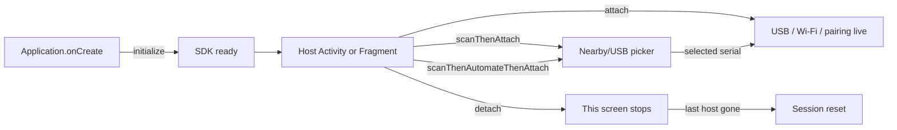

<p align="center">
  
</p>

<p align="center">
  <strong>PROVISIONER JATT SDK</strong><br/>
  <em>USB + wireless ADB provisioning. Your screens. Our connection.</em>
</p>

<p align="center">
  
  
  
  
  
</p>

<p align="center">
  Plug a device in. Pair over Wi-Fi. Push a DPC.<br/>
  The host app keeps every Activity and Fragment. The SDK owns ADB.
</p>

---

## What this SDK already does

You do **not** build these in the host app.

| Built in | You never write |
| --- | --- |
| USB ADB + Android 11+ wireless TLS ADB | Connection state machines |
| `UsbAttachedReceiver` + device filter | `USB_DEVICE_ATTACHED` on your Activity |
| USB permission + nearby Wi-Fi / location prompts | Permission plumbing |
| Six-digit wireless pairing overlay | Pairing Activity |
| Host QR pairing overlay (same dialog, switches with pair-code) | QR pairing Activity |
| Reopen QR or pair-code (`openQRToScan` / `openPairingDialog`) | Host overlay wiring |
| Serial-locked connected-device dialog | Host progress / DPC UI |
| Screen stays on while a host is attached | Keep-awake / wake lock |
| Auto-connect USB; 20s host-side wireless reconnect | Reconnect loops |
| Serial lock, scan, make owner, automate DPC | ADB shell scripts |
| Nearby/USB device picker (`scanThenAttach`) | Host serial-picker UI |
| Scan, set DPC package+URL, then attach (`scanThenAutomateThenAttach`) | Host serial picker + automation wiring |
| Dialog / pair / provision callbacks (`ProvisionerJattListener`) | Host dialog observers |
| Serial-locked QR + passcode FABs (`enableSingleModeQRPairCodeLauncher`) | Host-layout pair buttons |
| Serial-locked provisioning FAB (`enableSingleModeProvisioningFloating`) | Host-layout provision button |
| Connected / discoverable list widget (`ProvisionerJattDeviceList` / `ProvisionerJattDeviceListView`) | Host-written device cards |
| Device-owner check (`isDeviceOwner`) | Host `DevicePolicyManager` device-owner query |
| FRP (`addFRPAccount` / `setFRP` / `setOrganizationName`) | Host Google sign-in, factory-reset protection, and optional lock-screen org name |

Implementation path after JitPack: **depend → `initialize` → attach a host screen**.


```mermaid
flowchart LR
  A[Application.onCreate] -->|initialize| B[SDK ready]
  B --> C[Host Activity or Fragment]
  C -->|attach| D[USB / Wi-Fi / pairing live]
  C -->|scanThenAttach| P[Nearby/USB picker]
  C -->|scanThenAutomateThenAttach| P
  P -->|selected serial| D
  C -->|detach| E[This screen stops]
  E -->|last host gone| F[Session reset]
```

Every snippet is **Kotlin**, then **Java**. The sliding tab matches the block under it.

## Changelog

### v1.2.3

Published artifact is 1.2.3 (`com.beastblocks:provisioner-jatt`).

### v1.2.1

Compared with **v1.2.0**:

- Location and nearby-Wi-Fi declarations no longer use `maxSdkVersion="32"` or `neverForLocation`. Host apps that need location keep those permissions through API 36. The SDK still only *requests* location on API 32 and below, and `NEARBY_WIFI_DEVICES` on API 33+.
- After `openQRToScan()` / `openPairingDialog()` pairing succeeds, the overlay stays closed. It does not reopen QR when no serial is set.
- **QR pairing.** The host shows a scannable overlay. The pairing device uses Wireless debugging → Pair device with QR code. Auto-opens only with a serial lock and an unpaired discoverable wireless device. See **QR pairing**.
- **`openQRToScan()`** and **`openPairingDialog()`** reopen that overlay from the host (QR or six-digit). They do not attach a screen by themselves.
- **Single-mode launcher FABs.** `enableSingleModeQRPairCodeLauncher` (default false) draws QR + passcode floating buttons on the attached host when a serial is set. Optional `qrSingleModeIcon` / `pairCodeSingleModeIcon`. The host layout does not add them.
- **Provisioning FAB.** `enableSingleModeProvisioningFloating` (default **true**) draws a larger provision button under the passcode FAB when a serial is set. Tap calls `openProvisioningAutomation()`. Optional `singleModeProvisionFloatingIcon` and `singleModeProvisionFloatingNotConnectedMessage`. Independent of the QR/passcode launcher flag.
- **Device list widget.** `ProvisionerJattDeviceList` (Compose) and `ProvisionerJattDeviceListView` (XML) render connected or discoverable rows. Hosts pass `DeviceListKind.CONNECTED` or `DISCOVERABLE` plus that list. Cards match the original sample layout (no per-item logo). Colors follow `pairingColors` from `initialize`, or the SDK default palette.
- **`isDeviceOwner()`.** Checks whether the integrating app is device owner of **this** device. Does not change a paired ADB target.
- **FRP.** `ProvisionerJattFrp.addFRPAccount` runs Google’s current account chooser (Credential Manager) on the **calling host activity** (no SDK activity). Pass the OAuth **web client ID** as `serverClientId` on that call — not on `initialize`. After success the SDK returns `name`, `email`, and `frpToken`. `setFRP(token)` requires this app to be device owner and applies factory reset protection. Optional `ProvisionerJattFrp.setOrganizationName(orgName)` is a separate call on **that class only** (not on `ProvisionerJatt`): it internally checks that this host app is device owner, then writes the lock-screen organization name. Failures include a specific `reason`.
- FAB and list-item actions (make owner, remove owner, disconnect, scan, redo, confirm) use themed bounded ripples and haptic feedback when `enableVibrationFeedback` is true.
- **`ProvisionerOptions`:** `enableQRPairing`, `qrDisabledMessage`, `pairCodeErrorMessage`, `qrNoDevicesMessage`, `enableDismissDialogWhenTappedOutside`, `enableSingleModeQRPairCodeLauncher`, `qrSingleModeIcon`, `pairCodeSingleModeIcon`, `enableSingleModeProvisioningFloating`, `singleModeProvisionFloatingNotConnectedMessage`, `singleModeProvisionFloatingIcon`, `enableWireless` (default true; `false` turns off wireless discovery, pairing, and the QR and pairing-code overlays while USB attach and USB scan stay available).
- **`openProvisioningAutomation()`** opens the connected-device / DPC dialog when any device is READY; otherwise toasts `singleModeProvisionFloatingNotConnectedMessage`.
- **`ProvisionerJattListener`:** `onQRDialogInvoked` / `onQRDialogClosed`, `onPairingModeSwitch` (`QRTOPAIRCODE` / `PAIRCODETOQR`), `onQRPairCodeStatusUpdate` (use this instead of `onPairStatusUpdate`).
- The pairing device shows the **host app name** (`android:label`) instead of `provisionerjatt_<model>`.
- Minimum supported Gradle is documented as **8.13+** (AGP 8.11 floor).

Use `implementation("com.github.jatinsinghsatija:Provisioner-Jatt-SDK:v1.2.1")`.

### v1.2.0

Compared with **v1.1.1**:

- Keep-awake while a host is attached (`FLAG_KEEP_SCREEN_ON` + wake lock); released on `detach`, destroy, or the scan picker.
- Host-side wireless reconnect is bounded to **20 seconds**, with a countdown toast when a pairing advertisement is visible. A drop from the pairing device, `disconnectWireless`, or dialog **Disconnect** forgets that peer immediately.
- `scanThenAutomateThenAttach` picks a serial, stores package+URL, then attaches. Both automation fields are required.
- `enableSingleModeAutomationDialog`, `enableRememberAndReconnect`, and `enableReconnectProgressToast` on `ProvisionerOptions` (all default true).
- `ProvisionerJattListener` dialog and status callbacks; vibration, confirmation, and toast flags on `initialize`.
- Optional `scanDialogTitle` on `scanThenAttach`; connected-device dialog **Disconnect** closes the session and forgets wireless remembrance.
- User-facing copy, colors, spacing, integers, and option defaults live in `res/values` and are referenced from the SDK.

Use `implementation("com.github.jatinsinghsatija:Provisioner-Jatt-SDK:v1.2.0")`.

---

# Implementation

This section is what you must wire. Custom pairing modes, overlays, and theming are **features** later — not extra steps.

## SDK implementation

Open the **root** Gradle settings file. Add Google, Maven Central, and JitPack. JitPack serves this SDK (AAR + POM). The POM pulls the rest.

<p>
  
</p>

<p><sub>SETTINGS · SETTINGS.GRADLE.KTS</sub></p>

```kotlin
dependencyResolutionManagement {
    repositoriesMode.set(RepositoriesMode.FAIL_ON_PROJECT_REPOS)
    repositories {
        google()
        mavenCentral()
        maven("https://jitpack.io")
    }
}
```

<p>
  
</p>

<p><sub>SETTINGS · SETTINGS.GRADLE</sub></p>

```groovy
dependencyResolutionManagement {
    repositoriesMode.set(RepositoriesMode.FAIL_ON_PROJECT_REPOS)
    repositories {
        google()
        mavenCentral()
        maven { url 'https://jitpack.io' }
    }
}
```

In the **app** module, set `minSdk` 26. The SDK’s minimum supported Gradle is **8.13**. Add a single `implementation`. Do not drop a raw AAR into `app/libs/`. Do not re-declare the SDK’s transitive libraries. If your app already uses Compose for its own UI, keep those lines for the app — they are not required as SDK companions.

<p>
  
</p>

<p><sub>APP · BUILD.GRADLE.KTS</sub></p>

```kotlin
android {
    defaultConfig {
        minSdk = 26 // Gradle 8.13+
    }
}

dependencies {
    implementation("com.github.jatinsinghsatija:Provisioner-Jatt-SDK:v1.2.3")
}
```

<p>
  
</p>

<p><sub>APP · BUILD.GRADLE</sub></p>

```groovy
android {
    defaultConfig {
        minSdk 26 // Gradle 8.13+
    }
}

dependencies {
    implementation 'com.github.jatinsinghsatija:Provisioner-Jatt-SDK:v1.2.3'
}
```

`INTERNET`, USB host, and nearby-network permissions **merge from the AAR**. Do **not** put `USB_DEVICE_ATTACHED` on your Activity — the library receiver owns that filter.

Optional brand mark: copy `example/src/main/res/drawable/logo_provisioner.png` into `app/src/main/res/drawable/` as `logo_provisioner.png` if you want it on the pairing, nearby/USB picker, and connected-device dialogs.

---

## Initialize in `Application`

`initialize` stores options and starts the engine. It does **not** scan, prompt, or pair until a screen calls `attach`, `scanThenAttach`, or `scanThenAutomateThenAttach`. Overlay reopen (`openQRToScan` / `openPairingDialog`) also waits until a host is attached. The Google OAuth **web** client ID is not an initialize option; pass it to `ProvisionerJattFrp.addFRPAccount`.

Register the `Application` class in the manifest. `ProvisionerJatt.initialize(this)` is enough for every default. The block below lists **every** `ProvisionerOptions` field you can pass. Fields from `enableQRPairing` through `singleModeProvisionFloatingIcon` are **v1.2.1**. `enableWireless` defaults to true. Omit any field to keep its default.

<p>
  
</p>

<p><sub>APPLICATION · APP.KT</sub></p>

```kotlin
import android.app.Application
import com.beastblocks.provisionerjattsdk.PairingDialogColors
import com.beastblocks.provisionerjattsdk.ProvisionerJatt
import com.beastblocks.provisionerjattsdk.ProvisionerOptions

class App : Application() {
    override fun onCreate() {
        super.onCreate()
        ProvisionerJatt.initialize(
            this,
            ProvisionerOptions(
                // Dialog / overlay palette. Default: brand white / orange / yellow / black
                // from colors.xml (or PairingDialogColors.from(this)).
                pairingColors = PairingDialogColors(),
                // Watermark on pairing, scan picker, and connected-device dialogs. Default: null (none).
                pairingWatermarkResId = R.drawable.logo_provisioner,
                // Your own six-digit UI instead of the SDK dialog. Default: null (SDK draws the overlay).
                // Does not replace the QR view — that overlay is always the SDK UI.
                pairingCodeHandler = null,
                // After a serial-locked device is authorized, show the connected-device / DPC dialog.
                // Default: true. Has no effect unless a serial is set.
                showProvisionerDialog = true,
                // Haptics on dialogs, scan-row select, pairing digits, automation steps. Default: true.
                enableVibrationFeedback = true,
                // Ask before Confirm Device, Pair, and Disconnect. Default: true.
                enableConfirmation = true,
                // In-app alerts after scan confirm and after pairing plus connection. Default: true.
                enableToastAlerts = true,
                // Same connected-device dialog gate as showProvisionerDialog, including when a serial is locked.
                // Default: true. Pass false to never show that dialog.
                enableSingleModeAutomationDialog = true,
                // Persist paired wireless peers and auto-reconnect 20s after a host-side drop. Default: true.
                enableRememberAndReconnect = true,
                // Sticky 20s reconnect countdown toast while a pairing advertisement is visible. Default: true.
                enableReconnectProgressToast = true,
                // Host QR overlay + openQRToScan(). Default: true. False restores pre-QR pairing-code-only behavior.
                enableQRPairing = true,
                // Toast when openQRToScan() is called while QR pairing is disabled.
                qrDisabledMessage = ProvisionerOptions.DEFAULT_QR_DISABLED_MESSAGE,
                // Toast when openPairingDialog() is called and no pairing-code advertisement is on the LAN.
                pairCodeErrorMessage = ProvisionerOptions.DEFAULT_PAIR_CODE_ERROR_MESSAGE,
                // Toast when openQRToScan() is called and no unpaired discoverable wireless device is present.
                qrNoDevicesMessage = ProvisionerOptions.DEFAULT_QR_NO_DEVICES_MESSAGE,
                // Tap outside SDK dialogs to dismiss. Default: true. False keeps Close / Back only.
                enableDismissDialogWhenTappedOutside = true,
                // SDK-drawn QR + passcode FABs on a serial-locked host. Default: false (off).
                enableSingleModeQRPairCodeLauncher = false,
                // QR FAB icon. Default: null (SDK QR drawable). Tint uses pairingColors.
                qrSingleModeIcon = null,
                // Passcode FAB icon. Default: null (SDK passcode drawable). Tint uses pairingColors.
                pairCodeSingleModeIcon = null,
                // Larger provision FAB under passcode when a serial is set. Default: true.
                enableSingleModeProvisioningFloating = true,
                // Toast when openProvisioningAutomation() is called and no device is connected.
                singleModeProvisionFloatingNotConnectedMessage =
                    ProvisionerOptions.DEFAULT_PROVISION_FLOATING_NOT_CONNECTED_MESSAGE,
                // Provision FAB icon. Default: null (SDK provision drawable). Tint uses pairingColors.
                singleModeProvisionFloatingIcon = null,
                // Wireless discovery, pairing, QR, and pairing-code overlays. Default: true.
                // False leaves USB attach and USB scan available.
                enableWireless = true,
            ),
        )
        // Resource defaults only: ProvisionerJatt.initialize(this)
        // or ProvisionerJatt.initialize(this, ProvisionerOptions.from(this))
    }
}
```

```xml
<application
    android:name=".App"
    ... >
```

<p>
  
</p>

<p><sub>APPLICATION · APP.JAVA</sub></p>

```java
import android.app.Application;
import com.beastblocks.provisionerjattsdk.PairingDialogColors;
import com.beastblocks.provisionerjattsdk.ProvisionerJatt;
import com.beastblocks.provisionerjattsdk.ProvisionerOptions;

public class App extends Application {
    @Override
    public void onCreate() {
        super.onCreate();
        ProvisionerJatt.initialize(
            this,
            new ProvisionerOptions(
                PairingDialogColors.from(this), // palette; default brand colors from colors.xml
                R.drawable.logo_provisioner,   // watermark; null = none
                null,                          // pairingCodeHandler; null = SDK overlay
                true,                          // showProvisionerDialog; default true
                true,                          // enableVibrationFeedback; default true
                true,                          // enableConfirmation; default true
                true,                          // enableToastAlerts; default true
                true,                          // enableSingleModeAutomationDialog; default true
                true,                          // enableRememberAndReconnect; default true
                true,                          // enableReconnectProgressToast; default true
                true,                          // enableQRPairing; default true
                ProvisionerOptions.DEFAULT_QR_DISABLED_MESSAGE,      // openQRToScan while QR disabled
                ProvisionerOptions.DEFAULT_PAIR_CODE_ERROR_MESSAGE,  // openPairingDialog with no pair-code ad
                ProvisionerOptions.DEFAULT_QR_NO_DEVICES_MESSAGE,    // openQRToScan with no pairable device
                true,                          // enableDismissDialogWhenTappedOutside; default true
                false,                         // enableSingleModeQRPairCodeLauncher; default false
                null,                          // qrSingleModeIcon; null = SDK QR icon
                null,                          // pairCodeSingleModeIcon; null = SDK passcode icon
                true,                          // enableSingleModeProvisioningFloating; default true
                ProvisionerOptions.DEFAULT_PROVISION_FLOATING_NOT_CONNECTED_MESSAGE,
                null,                          // singleModeProvisionFloatingIcon; null = SDK provision icon
                true                           // enableWireless; default true
            )
        );
        // Defaults only: ProvisionerJatt.initialize(this);
    }
}
```

```xml
<application
    android:name=".App"
    ... >
```

| Parameter | Default | Purpose |
| --- | --- | --- |
| `pairingColors` | Brand colors from `colors.xml` | Tints pairing, scan picker, confirmation, connected-device UI, toasts |
| `pairingWatermarkResId` | `null` | Optional drawable behind pairing/provisioner dialogs, list cards (both kinds), and empty states |
| `pairingCodeHandler` | `null` | If set, the SDK does not draw its **six-digit** pairing dialog — you submit the code. The **QR** view is still the SDK overlay |
| `showProvisionerDialog` | `true` | Connected-device / DPC overlay after a **serial-locked** device is authorized |
| `enableVibrationFeedback` | `true` | Haptic pulse on dialogs, scan select, pairing digits, automation steps, FAB taps, and list-item actions (make owner, remove owner, disconnect, scan, redo) |
| `enableConfirmation` | `true` | Confirm Device, Pair, and Disconnect ask first |
| `enableToastAlerts` | `true` | Alerts after scan confirm and after pairing plus connection |
| `enableSingleModeAutomationDialog` | `true` | Same connected-device dialog; `false` hides it even with a serial |
| `enableRememberAndReconnect` | `true` | Remember wireless peers; 20s reconnect only after a **host-side** drop |
| `enableReconnectProgressToast` | `true` | Countdown toast during that 20s window if a pairing advertisement is open |
| `enableQRPairing` | `true` | Host QR overlay + `openQRToScan()`. Auto-opens only with a serial. `false` restores pairing-code-only behavior |
| `qrDisabledMessage` | `QR functionality has been disabled for this build. Will be there soon.` | Toast when `openQRToScan()` is called while QR is disabled |
| `pairCodeErrorMessage` | `No device available to pair with Pairing Code` | Toast when `openPairingDialog()` is called and no pairing-code advertisement is on the LAN |
| `qrNoDevicesMessage` | `No device available to pair and connect` | Toast when `openQRToScan()` is called and no unpaired discoverable wireless device is present |
| `enableDismissDialogWhenTappedOutside` | `true` | Tap the dimmed area to dismiss SDK dialogs (scan, pairing/QR, connected-device, confirmations, alerts). `false` keeps Close / Confirm / Cancel / Back only |
| `enableSingleModeQRPairCodeLauncher` | `false` | When a **serial is set**, draw QR + passcode FABs on the attached host. Host layout does not add them. Clicks call `openQRToScan()` / `openPairingDialog()` |
| `qrSingleModeIcon` | `null` (SDK QR icon) | Drawable for the QR FAB. Tint is `pairingColors.onAccent` on `accent` |
| `pairCodeSingleModeIcon` | `null` (SDK passcode icon) | Drawable for the passcode FAB. Same tint |
| `enableSingleModeProvisioningFloating` | `true` | When a **serial is set**, draw a larger provision FAB under the passcode button (or alone if the QR/passcode launcher is off). Host layout does not add it. Click calls `openProvisioningAutomation()` |
| `singleModeProvisionFloatingNotConnectedMessage` | `Device not connected` | Toast when `openProvisioningAutomation()` is called and no device is connected |
| `singleModeProvisionFloatingIcon` | `null` (SDK provision icon) | Drawable for the provision FAB. Same tint |
| `enableWireless` | `true` | Wireless discovery, pairing, QR, and pairing-code overlays. `false` leaves USB attach and USB scan available |

Calling `initialize` again later only **updates options**. It does not re-scan or re-pair.

---

## Attach SDK

Pairing, permissions, and auto-connect run only on Activities you attach. The SDK never starts its own Activity. Use the window the user is looking at.

`attach` / `scanThenAttach` / `scanThenAutomateThenAttach` all need:

- **Activity** — the window that hosts overlays (`this` on an Activity, `requireActivity()` on a Fragment)
- **LifecycleOwner** — Activity: `this`. Fragment: `this` or `viewLifecycleOwner` / `getViewLifecycleOwner()`

> **Note:** These functions can be called **any time** from an Activity or Fragment (after `super.onCreate()` / `super.onViewCreated()`, from a button, after you save a serial, and so on). You do not have to call them only once in `onCreate`. Switching attached screens does **not** require `initialize` again.

While a host is attached, that screen is kept on. The wake lock is released on `detach`, when the host is destroyed, or when the scan picker temporarily drops the host (it is acquired again after a confirmed selection calls `attach`).

### `attach` — open the live session

Use this when the host should start USB + wireless discovery, pairing overlay, and auto-connect immediately.

<p>
  
</p>

<p><sub>ACTIVITY · PROVISIONERACTIVITY.KT</sub></p>

```kotlin
import android.os.Bundle
import androidx.activity.ComponentActivity
import com.beastblocks.provisionerjattsdk.ProvisionerClient
import com.beastblocks.provisionerjattsdk.ProvisionerJatt
import com.beastblocks.provisionerjattsdk.ProvisionerJattListener

class ProvisionerActivity : ComponentActivity() {
    private lateinit var client: ProvisionerClient

    override fun onCreate(savedInstanceState: Bundle?) {
        super.onCreate(savedInstanceState)
        // Live session on this window. No serial lock → multi-device pairing.
        client = ProvisionerJatt.attach(this, this)

        // Serial lock first, then attach. Listing / pairing / auto-connect use that serial.
        // client = ProvisionerJatt.attach(this, this, "SERIAL")

        // Same, with dialog / pair / provision callbacks until detach.
        // client = ProvisionerJatt.attach(this, this, "SERIAL", listener)
    }
}
```

<p>
  
</p>

<p><sub>ACTIVITY · PROVISIONERACTIVITY.JAVA</sub></p>

```java
import android.os.Bundle;
import androidx.annotation.Nullable;
import androidx.appcompat.app.AppCompatActivity;
import com.beastblocks.provisionerjattsdk.ProvisionerClient;
import com.beastblocks.provisionerjattsdk.ProvisionerJatt;

public class ProvisionerActivity extends AppCompatActivity {
    private ProvisionerClient client;

    @Override
    protected void onCreate(@Nullable Bundle savedInstanceState) {
        super.onCreate(savedInstanceState);
        client = ProvisionerJatt.attach(this, this);
        // client = ProvisionerJatt.attach(this, this, "SERIAL");
        // client = ProvisionerJatt.attach(this, this, "SERIAL", listener);
    }
}
```

| Declaration | Purpose |
| --- | --- |
| `attach(activity, lifecycleOwner)` | Start the live session on this window. No serial → any eligible USB / wireless device |
| `attach(activity, lifecycleOwner, serial)` | Save that serial, then attach. Single-device lock from the first frame |
| `attach(activity, lifecycleOwner, serial, listener)` | Same, and bind `ProvisionerJattListener` until `detach` |

Fragment: `ProvisionerJatt.attach(requireActivity(), viewLifecycleOwner)`.

### `scanThenAttach` — pick a serial, then attach

Use this when the host should **not** type or hard-code a serial. It is an addition to `attach`, not a replacement.

It runs **before** `attach`. It is **not** the pairing overlay. The library shows **Nearby/USB Plugged Devices** (override with `scanDialogTitle`). Searching starts when the dialog opens and stops when it closes. Confirming a row whose serial is known calls `attach` with that serial. Closing without a selection does not attach.

The picker does **not** pair, open ADB, or provision.

<p>
  
</p>

<p><sub>ACTIVITY · SCANTHENATTACH</sub></p>

```kotlin
// Full screen: picker instead of attach(this, this)
client = ProvisionerJatt.scanThenAttach(this, this)

// Custom title
client = ProvisionerJatt.scanThenAttach(this, this, "Choose a device")

// From a button on an already-created client
client.scanThenAttach(this, this)

// With listener
client = ProvisionerJatt.scanThenAttach(this, this, listener, "Choose a device")
```

<p>
  
</p>

<p><sub>ACTIVITY · SCANTHENATTACH</sub></p>

```java
client = ProvisionerJatt.scanThenAttach(this, this);
client = ProvisionerJatt.scanThenAttach(this, this, "Choose a device");
client.scanThenAttach(this, this);
client = ProvisionerJatt.scanThenAttach(this, this, listener, "Choose a device");
```

| Declaration | Purpose |
| --- | --- |
| `scanThenAttach(activity, lifecycleOwner)` | Picker, then `attach` with the selected serial |
| `scanThenAttach(activity, lifecycleOwner, scanDialogTitle)` | Same, custom dialog title |
| `scanThenAttach(activity, lifecycleOwner, listener)` | Same, bind listener until `detach` |
| `scanThenAttach(activity, lifecycleOwner, listener, scanDialogTitle)` | Title + listener |

### `scanThenAutomateThenAttach` — pick a serial, store DPC, then attach

Same picker as `scanThenAttach`. After the serial is saved it also stores **package name + HTTPS APK URL**, then `attach`. Both automation fields are **required**. Auto-provision runs only on that serial once the device is authorized.

<p>
  
</p>

<p><sub>ACTIVITY · SCANTHENAUTOMATETHENATTACH</sub></p>

```kotlin
client = ProvisionerJatt.scanThenAutomateThenAttach(
    this,
    this,
    packageName = "com.example.dpc",
    downloadUrl = "https://example.com/dpc.apk",
)
// Optional listener / title:
// ProvisionerJatt.scanThenAutomateThenAttach(this, this, pkg, url, listener, "Choose a device")
```

<p>
  
</p>

<p><sub>ACTIVITY · SCANTHENAUTOMATETHENATTACH</sub></p>

```java
client = ProvisionerJatt.scanThenAutomateThenAttach(
    this,
    this,
    "com.example.dpc",
    "https://example.com/dpc.apk"
);
// ProvisionerJatt.scanThenAutomateThenAttach(this, this, pkg, url, listener, "Choose a device");
```

| Declaration | Purpose |
| --- | --- |
| `scanThenAutomateThenAttach(activity, lifecycleOwner, packageName, downloadUrl)` | Picker → save serial + DPC package/URL → `attach` |
| `…(…, listener)` | Same, bind listener until `detach` |
| `…(…, listener, scanDialogTitle)` | Same, custom picker title |

After `initialize` / any attach form, anywhere on a host screen:

<p>
  
</p>

```kotlin
val client = ProvisionerJatt.get()
```

<p>
  
</p>

```java
ProvisionerClient client = ProvisionerJatt.get();
```

While that host is attached you can also reopen pairing from your own UI — `openQRToScan()` and `openPairingDialog()`. They are **not** attach forms. They need an active session. Full contract is under **Exposed functions**; product behavior is under **QR pairing**.

---

## Detach and `LifecycleOwner`

`detach` removes **this Activity** as a host window. Pairing, permission prompts, and auto-connect no longer use it. The keep-screen-on wake lock for that window is released. If it was the last host, the live ADB session resets.

Destroy also detaches automatically when you passed a `LifecycleOwner`. You still may call `detach` yourself (for example in `onDestroy` / `onDestroyView` / `onPause` for a pager page).

Always pass the **Activity**, not a Fragment context: `detach(this)` or `ProvisionerJatt.detach(requireActivity())`.

| Owner you pass | Auto-detach when |
| --- | --- |
| Activity (`this`, `this`) | Activity `ON_DESTROY` |
| Fragment `viewLifecycleOwner` | Fragment view destroyed (`onDestroyView`) |
| Fragment `this` | Fragment `ON_DESTROY` |

If you pass the **activity** as owner from a fragment, the session stays live until the activity is destroyed — even after the fragment’s view is gone.

<p>
  
</p>

<p><sub>ACTIVITY · ONDESTROY</sub></p>

```kotlin
override fun onDestroy() {
    if (::client.isInitialized) client.detach(this)
    super.onDestroy()
}
```

<p>
  
</p>

<p><sub>ACTIVITY · ONDESTROY</sub></p>

```java
@Override
protected void onDestroy() {
    if (client != null) {
        client.detach(this);
    }
    super.onDestroy();
}
```

Hosts are keyed by Activity. The first `detach(activity)` drops that window even if another fragment on the same activity still wanted it — only **one** fragment should attach at a time.

`detach` also unbinds `ProvisionerJattListener`.

---

## Exposed functions

All of these hang off `ProvisionerClient` (`ProvisionerJatt.get()`, or the value returned by `attach` / `scanThenAttach`). Comments in the snippets are the contract.

<p>
  
</p>

<p><sub>CLIENT · KOTLIN</sub></p>

```kotlin
val client = ProvisionerJatt.get()

// Snapshot of settings + devices + pairing UI state.
val ui = client.state.value

// Every known target (USB + wireless), any connection state.
val all = client.devices.value
// Not yet READY (discovered, connecting, unauthorized, failed, …).
val nearby = client.discoveredDevices.value
// Authorized ADB sessions.
val ready = client.connectedDevices.value

// Current package / URL / serial / mode. Does not start work by itself.
val settings = client.automation()

// Hands-off DPC: valid package + HTTPS APK URL. Independent of serial.
// Returns false if package or URL is missing/invalid. Does not change serial.
client.setAutomation("com.example.dpc", "https://example.com/dpc.apk")
client.clearAutomation()          // package + URL only
client.setSerial("SERIAL")        // lock listing / pairing / auto-connect to this serial
client.clearSerial()
client.clearAutomationAndSerial()

// Manual DPC on a connected device (when you draw your own cards, or retry).
client.scan(deviceId)                                  // list DeviceAdminReceiver components
client.makeDeviceOwner(deviceId, component)            // dpm set-device-owner + launch
client.removeOwner(deviceId, component)                // dpm remove-active-admin (test-only)
client.retryProvisioning(deviceId)                     // re-run automation or make-owner / scan
client.disconnectWireless(deviceId)                    // host disconnect; forgets that wireless peer

// If you drew your own pairing UI (pairingCodeHandler), or to drive the default overlay.
client.submitPairingCode("123456")
client.dismissPairing()

// Reopen pairing overlays on an attached host. Both return false when they cannot open.
client.openQRToScan()       // QR view. Needs enableQRPairing + an unpaired discoverable wireless device.
client.openPairingDialog()  // Six-digit view. Needs a pairing-code advertisement on the LAN.
client.openProvisioningAutomation() // Connected-device dialog if any device is READY.

// If *this* app is device owner of this device, set the lock-screen organization name.
ProvisionerJatt.isDeviceOwner()
ProvisionerJattFrp.setOrganizationName("Acme")

ProvisionerJattFrp.addFRPAccount(this, { result -> /* name, email, frpToken or reason */ }, getString(R.string.default_web_client_id))
ProvisionerJattFrp.setFRP(frpToken)

// After the user grants nearby / location permission from your own prompt.
client.onLocalNetworkPermissionGranted()

// Same attach family as ProvisionerJatt.*, from an existing client.
client.attach(this, this)
client.scanThenAttach(this, this)
client.scanThenAutomateThenAttach(this, this, pkg, url)
client.detach(this)

// Drop live ADB and restart discovery if a host is still in front.
client.resetSession()
ProvisionerJatt.isSessionActive()
```

<p>
  
</p>

<p><sub>CLIENT · JAVA</sub></p>

```java
ProvisionerClient client = ProvisionerJatt.get();

client.getState().getValue();
client.getDevices().getValue();
client.getDiscoveredDevices().getValue();
client.getConnectedDevices().getValue();
client.automation();

client.setAutomation("com.example.dpc", "https://example.com/dpc.apk");
client.clearAutomation();
client.setSerial("SERIAL");
client.clearSerial();
client.clearAutomationAndSerial();

client.scan(deviceId);
client.makeDeviceOwner(deviceId, component);
client.removeOwner(deviceId, component);
client.retryProvisioning(deviceId);
client.disconnectWireless(deviceId);

client.submitPairingCode("123456");
client.dismissPairing();
boolean qrOpened = client.openQRToScan();
boolean pairOpened = client.openPairingDialog();
boolean provisionOpened = client.openProvisioningAutomation();
boolean deviceOwner = client.isDeviceOwner();
FrpSetResult orgApplied = ProvisionerJattFrp.setOrganizationName("Acme");
ProvisionerJattFrp.addFRPAccount(this, result -> { /* name, email, frpToken or reason */ }, getString(R.string.default_web_client_id));
FrpSetResult frpApplied = ProvisionerJattFrp.setFRP(frpToken);
client.onLocalNetworkPermissionGranted();

client.attach(this, this);
client.scanThenAttach(this, this);
client.scanThenAutomateThenAttach(this, this, pkg, url);
client.detach(this);
client.resetSession();
ProvisionerJatt.isSessionActive();
```

### `openQRToScan` — show the host QR overlay

Use this when a host is already attached and you want the QR view on demand (toolbar button, no serial lock, or after the user closed QR). It is **not** `attach`. It does not start discovery by itself.

Returns `true` only when the overlay opens in QR mode.

<p>
  
</p>

<p><sub>CLIENT · OPENQRTOSCAN</sub></p>

```kotlin
val opened = client.openQRToScan()
```

<p>
  
</p>

<p><sub>CLIENT · OPENQRTOSCAN</sub></p>

```java
boolean opened = client.openQRToScan();
```

| Result | When |
| --- | --- |
| Overlay opens, returns `true` | Host session is active, `enableQRPairing` is true, and at least one unpaired discoverable wireless device is present and not connected |
| Toast `qrDisabledMessage`, returns `false` | `enableQRPairing` is false |
| Toast `qrNoDevicesMessage`, returns `false` | QR is enabled, session is active, but nothing unpaired and discoverable is on the LAN |
| Silent `false` | No host session (`attach` / scan-then-attach has not run, or everything is detached) |

Product rules (auto-open, serial lock, mode switch) are under **QR pairing**.

### `openPairingDialog` — show the six-digit overlay

Use this when a host is already attached and you want the pairing-code view again (after Close, or from a passcode button). It is **not** `attach`.

Returns `true` only when the overlay opens in six-digit mode.

<p>
  
</p>

<p><sub>CLIENT · OPENPAIRINGDIALOG</sub></p>

```kotlin
val opened = client.openPairingDialog()
```

<p>
  
</p>

<p><sub>CLIENT · OPENPAIRINGDIALOG</sub></p>

```java
boolean opened = client.openPairingDialog();
```

| Result | When |
| --- | --- |
| Overlay opens, returns `true` | Host session is active and a pairing-code advertisement is on the LAN (device tags when more than one is present) |
| Toast `pairCodeErrorMessage`, returns `false` | Session is active but nothing is advertising a pairing code |
| Silent `false` | No host session |

When `enableSingleModeQRPairCodeLauncher` is true and a serial is set, the SDK draws buttons that call these two functions. See **Single-mode QR / pair-code launcher**.

### `openProvisioningAutomation` — show the connected-device dialog

Use this when a host is already attached and you want the provisioning / DPC overlay on demand (the large serial-locked FAB, or your own button). It is **not** `attach`.

Returns `true` only when the connected-device dialog is shown.

<p>
  
</p>

<p><sub>CLIENT · OPENPROVISIONINGAUTOMATION</sub></p>

```kotlin
val opened = client.openProvisioningAutomation()
```

<p>
  
</p>

<p><sub>CLIENT · OPENPROVISIONINGAUTOMATION</sub></p>

```java
boolean opened = client.openProvisioningAutomation();
```

| Result | When |
| --- | --- |
| Overlay opens, returns `true` | Host session is active and at least one device is `READY` |
| Toast `singleModeProvisionFloatingNotConnectedMessage`, returns `false` | Session is active but no connected device |
| Silent `false` | No host session |

The toast still shows when `enableToastAlerts` is false — this call is an explicit host action. See **Single-mode provisioning FAB**.

### `isDeviceOwner` — this app as device owner

**Use when:** you need to know whether the app this SDK is integrated into is the **device owner of that same device**. This is **this device**, not a paired phone you provision over ADB.

**How:** `ProvisionerJatt.isDeviceOwner()` (or `client.isDeviceOwner()`). Pass a `Context` when `initialize` has not run yet.

| Result | When |
| --- | --- |
| Returns `true` | This app is device owner of this device |
| Returns `false` | This app is not device owner, `initialize` has not run and no `Context` was passed, or the SDK is not licensed |

### `addFRPAccount` / `setFRP` / `setOrganizationName` — factory reset protection

**Use when:** you need a Google-account FRP token from the integrating app, then later apply that token on a **device-owner** app. Optionally set the lock-screen organization name on that same device-owner app.

**How:** `addFRPAccount(activity, callback, serverClientId)` runs Google’s current account chooser **on that same host activity**. There is no extra SDK activity. The chooser is Credential Manager (`GetGoogleIdOption`), which shows the host app identity from that OAuth client. The **web client ID** is required on this call (`serverClientId`). Do not pass it to `initialize`. See **Get a Web client ID**. On success the SDK returns `name`, `email`, and `frpToken`, then clears the Credential Manager sign-in state. `setFRP(token)` runs on this device: if the app is not device owner it fails; otherwise it applies factory reset protection from that token. Optional `setOrganizationName(orgName)` is a **separate** call (it is not part of add/set FRP). It internally checks that **this host app** is device owner of this device, then writes the lock-screen organization name. Blank `orgName` clears it. Pass a `Context` when `initialize` has not run.

**What happens:** only `addFRPAccount`, `setFRP`, and `setOrganizationName` are public on `ProvisionerJattFrp`. Failures return `success = false` with a specific `reason` (cancelled sign-in, Play services missing, not device owner, invalid token, and so on).

<p>
  
</p>

<p><sub>CLIENT · FRP</sub></p>

```kotlin
ProvisionerJattFrp.addFRPAccount(this, { result ->
    if (result.success) {
        val name = result.name
        val email = result.email
        val frpToken = result.frpToken
    } else {
        val reason = result.reason
    }
}, getString(R.string.default_web_client_id))
val applied = ProvisionerJattFrp.setFRP(frpToken)
val org = ProvisionerJattFrp.setOrganizationName("Acme")
```

<p>
  
</p>

<p><sub>CLIENT · FRP</sub></p>

```java
ProvisionerJattFrp.addFRPAccount(this, result -> {
    if (result.getSuccess()) {
        String name = result.getName();
        String email = result.getEmail();
        String frpToken = result.getFrpToken();
    } else {
        String reason = result.getReason();
    }
}, getString(R.string.default_web_client_id));
FrpSetResult applied = ProvisionerJattFrp.setFRP(frpToken);
FrpSetResult org = ProvisionerJattFrp.setOrganizationName("Acme");
```

| Result | When |
| --- | --- |
| `addFRPAccount` `success` | Google account chooser returned an account and `frpToken` is ready, then Credential Manager state was cleared |
| `addFRPAccount` failure | Missing host web client ID, Play services missing, sign-in cancelled or failed, or a sign-in is already running |
| `setFRP` `success` | This app is device owner and factory reset protection was applied from `token` |
| `setFRP` failure | Not device owner, empty or invalid token, no admin, or the system rejected the FRP policy |
| `setOrganizationName` `success` | This host app is device owner and `orgName` was written to the lock screen |
| `setOrganizationName` failure | Not device owner, no admin, `initialize` has not run and no `Context` was passed, or the system rejected the change |

### Device lists (optional)

Kotlin Flow collection (optional — automation and pairing still run if you never collect):

<p>
  
</p>

```kotlin
lifecycleScope.launch {
    client.discoveredDevices.collect { /* pending */ }
}
lifecycleScope.launch {
    client.connectedDevices.collect { /* ready */ }
}
```

```java
client.getDiscoveredDevices().getValue(); // snapshot
client.getConnectedDevices().getValue();
```

Do not rebuild those rows in the host. Pass the same lists to the SDK widget with `DeviceListKind.CONNECTED` or `DeviceListKind.DISCOVERABLE`. Compose: `ProvisionerJattDeviceList`. XML: `ProvisionerJattDeviceListView`. See **Device list widget**.

### `ProvisionerJattListener`

Optional. Bound on `attach` / `scanThenAttach` / `scanThenAutomateThenAttach`. Cleared on `detach`. Every method has an empty default — implement only what you need.

One overlay serves QR and six-digit. **Invoked / closed** fire for the mode the overlay **opened** or **closed** in. Switching modes does **not** fire closed + invoked; it fires `onPairingModeSwitch` only.

<p>
  
</p>

<p><sub>LISTENER · KOTLIN</sub></p>

```kotlin
import com.beastblocks.provisionerjattsdk.PairStatus
import com.beastblocks.provisionerjattsdk.PairingModeSwitch
import com.beastblocks.provisionerjattsdk.ProvisionerJattListener
import com.beastblocks.provisionerjattsdk.ProvisioningStatus

val listener = object : ProvisionerJattListener {
    override fun onNearbyScanDialogInvoked() {}
    override fun onNearbyScanDialogClosed() {}
    override fun onPairingDialogInvoked() {}
    override fun onPairingDialogClosed() {}
    override fun onQRDialogInvoked() {}
    override fun onQRDialogClosed() {}
    override fun onPairingModeSwitch(change: PairingModeSwitch) {}
    override fun onProvisioningDialogInvoked() {}
    override fun onProvisioningDialogClosed() {}
    override fun onQRPairCodeStatusUpdate(status: PairStatus) {}
    override fun onProvisioningStatusUpdate(status: ProvisioningStatus) {}
}

client = ProvisionerJatt.attach(this, this, serial, listener)
```

<p>
  
</p>

<p><sub>LISTENER · JAVA</sub></p>

```java
import com.beastblocks.provisionerjattsdk.PairStatus;
import com.beastblocks.provisionerjattsdk.PairingModeSwitch;
import com.beastblocks.provisionerjattsdk.ProvisionerJattListener;
import com.beastblocks.provisionerjattsdk.ProvisioningStatus;

ProvisionerJattListener listener = new ProvisionerJattListener() {
    @Override public void onNearbyScanDialogInvoked() {}
    @Override public void onNearbyScanDialogClosed() {}
    @Override public void onPairingDialogInvoked() {}
    @Override public void onPairingDialogClosed() {}
    @Override public void onQRDialogInvoked() {}
    @Override public void onQRDialogClosed() {}
    @Override public void onPairingModeSwitch(PairingModeSwitch change) {}
    @Override public void onProvisioningDialogInvoked() {}
    @Override public void onProvisioningDialogClosed() {}
    @Override public void onQRPairCodeStatusUpdate(PairStatus status) {}
    @Override public void onProvisioningStatusUpdate(ProvisioningStatus status) {}
};

client = ProvisionerJatt.attach(this, this, serial, listener);
```

| Callback | When |
| --- | --- |
| `onNearbyScanDialogInvoked` / `onNearbyScanDialogClosed` | Nearby/USB picker (`scanThenAttach` / `scanThenAutomateThenAttach`) opens or closes |
| `onQRDialogInvoked` | Overlay **opens** in QR mode (auto-open or `openQRToScan()`) |
| `onQRDialogClosed` | Overlay **closes** while still in QR mode (Close, device gone, connected) |
| `onPairingDialogInvoked` | Overlay **opens** in six-digit mode (pair-code advertisement or `openPairingDialog()`) |
| `onPairingDialogClosed` | Overlay **closes** while still in six-digit mode |
| `onPairingModeSwitch` | Overlay stays open and switches QR ↔ six-digit. `QRTOPAIRCODE` or `PAIRCODETOQR`. Invoked / closed do **not** fire |
| `onProvisioningDialogInvoked` / `onProvisioningDialogClosed` | Serial-locked connected-device / DPC dialog opens or closes |
| `onQRPairCodeStatusUpdate` | Pairing then connection progress for **both** QR scan and six-digit code |
| `onProvisioningStatusUpdate` | Automation / make-owner / remove-owner progress |
| `onPairStatusUpdate` | **Deprecated.** The default `onQRPairCodeStatusUpdate` still calls this, so hosts that only override the old name keep working |

`PairStatus` (via `onQRPairCodeStatusUpdate`): `PAIRING_STARTED` → `PAIRING_ESTABLISHED` → `CONNECTION_STARTED` → `CONNECTION_ESTABLISHED`.

`PairingModeSwitch`: `QRTOPAIRCODE` when the overlay changes from QR to six-digit, `PAIRCODETOQR` the other way.

`ProvisioningStatus`: `AUTHENTICATING`, `SCANNING`, `DOWNLOADING_APK`, `SENDING_APK`, `INSTALLING`, `SETTING_DEVICE_OWNER`, `LAUNCHING`, `RETRYING`, `SUCCEEDED`, `FAILED`, `OWNER_REMOVED`.

---

# Fragments — three host scenarios

`attach` still needs the **Activity** (`requireActivity()`), not a fragment `Context`. Pass the **fragment** (or `viewLifecycleOwner`) as `LifecycleOwner` so destroy of the fragment can auto-detach.

Only **one** fragment should attach at a time. Hosts are keyed by Activity. The first `detach(activity)` drops that window even if another fragment still wanted it.

---

## Scenario 1 — One fragment inside an activity

When the fragment appears, attach. When it is destroyed, detach. If you skip `detach`, the fragment `LifecycleOwner` still unbinds on destroy. If you passed the **activity** as owner instead, the session stays live until the activity is destroyed.

<p>
  
</p>

<p><sub>FRAGMENT · PROVISIONERFRAGMENT.KT</sub></p>

```kotlin
import android.os.Bundle
import android.view.View
import androidx.fragment.app.Fragment
import com.beastblocks.provisionerjattsdk.ProvisionerClient
import com.beastblocks.provisionerjattsdk.ProvisionerJatt

class ProvisionerFragment : Fragment(R.layout.fragment_provisioner) {
    private var client: ProvisionerClient? = null

    override fun onViewCreated(view: View, savedInstanceState: Bundle?) {
        super.onViewCreated(view, savedInstanceState)
        client = ProvisionerJatt.attach(requireActivity(), viewLifecycleOwner)
    }

    override fun onDestroyView() {
        ProvisionerJatt.detach(requireActivity())
        client = null
        super.onDestroyView()
    }
}
```

<p>
  
</p>

<p><sub>FRAGMENT · PROVISIONERFRAGMENT.JAVA</sub></p>

```java
import android.os.Bundle;
import android.view.View;
import androidx.annotation.NonNull;
import androidx.annotation.Nullable;
import androidx.fragment.app.Fragment;
import com.beastblocks.provisionerjattsdk.ProvisionerClient;
import com.beastblocks.provisionerjattsdk.ProvisionerJatt;

public class ProvisionerFragment extends Fragment {
    private ProvisionerClient client;

    public ProvisionerFragment() {
        super(R.layout.fragment_provisioner);
    }

    @Override
    public void onViewCreated(@NonNull View view, @Nullable Bundle savedInstanceState) {
        super.onViewCreated(view, savedInstanceState);
        client = ProvisionerJatt.attach(requireActivity(), getViewLifecycleOwner());
    }

    @Override
    public void onDestroyView() {
        ProvisionerJatt.detach(requireActivity());
        client = null;
        super.onDestroyView();
    }
}
```

Rotation recreates the activity. The new fragment must `attach` again in `onViewCreated`.

---

## Scenario 2 — Fragments stacked (`hide` / `show`)

Only the provisioner fragment attaches. Use `onHiddenChanged` for `hide()` / `show()`. It is **not** called the first time the fragment is shown — still attach on first `onResume` when `isHidden` is false.

`onHiddenChanged` does **not** run for `replace()` / `remove()`. Those go through pause/destroy — `onDestroyView` still detaches.

<p>
  
</p>

<p><sub>FRAGMENT · STACKEDPROVISIONERFRAGMENT.KT</sub></p>

```kotlin
class StackedProvisionerFragment : Fragment(R.layout.fragment_provisioner) {
    private var client: ProvisionerClient? = null

    private fun bind() {
        client = ProvisionerJatt.attach(requireActivity(), viewLifecycleOwner)
    }

    private fun unbind() {
        ProvisionerJatt.detach(requireActivity())
        client = null
    }

    override fun onResume() {
        super.onResume()
        if (!isHidden) bind()
    }

    override fun onHiddenChanged(hidden: Boolean) {
        super.onHiddenChanged(hidden)
        if (hidden) unbind() else bind()
    }

    override fun onDestroyView() {
        unbind()
        super.onDestroyView()
    }
}
```

<p>
  
</p>

<p><sub>FRAGMENT · STACKEDPROVISIONERFRAGMENT.JAVA</sub></p>

```java
public class StackedProvisionerFragment extends Fragment {
    private ProvisionerClient client;

    public StackedProvisionerFragment() {
        super(R.layout.fragment_provisioner);
    }

    private void bind() {
        client = ProvisionerJatt.attach(requireActivity(), getViewLifecycleOwner());
    }

    private void unbind() {
        ProvisionerJatt.detach(requireActivity());
        client = null;
    }

    @Override
    public void onResume() {
        super.onResume();
        if (!isHidden()) bind();
    }

    @Override
    public void onHiddenChanged(boolean hidden) {
        super.onHiddenChanged(hidden);
        if (hidden) unbind();
        else bind();
    }

    @Override
    public void onDestroyView() {
        unbind();
        super.onDestroyView();
    }
}
```

---

## Scenario 3 — ViewPager / ViewPager2

Attach only in the **one** provisioner page. Use **`onResume` / `onPause`**. ViewPager2 keeps only the current page `RESUMED`, so swipe away detaches and swipe back attaches again.

Do **not** use `onHiddenChanged` (ViewPager does not `hide()` pages). Do **not** use `setUserVisibleHint` (deprecated; ViewPager2 never calls it).

Old ViewPager **without** `BEHAVIOR_RESUME_ONLY_CURRENT_FRAGMENT` can keep offscreen pages resumed, so `onPause` may not run on swipe. Prefer ViewPager2, or that behavior flag.

<p>
  
</p>

<p><sub>FRAGMENT · PAGERPROVISIONERFRAGMENT.KT</sub></p>

```kotlin
class PagerProvisionerFragment : Fragment(R.layout.fragment_provisioner) {
    private var client: ProvisionerClient? = null

    override fun onResume() {
        super.onResume()
        client = ProvisionerJatt.attach(requireActivity(), viewLifecycleOwner)
    }

    override fun onPause() {
        ProvisionerJatt.detach(requireActivity())
        client = null
        super.onPause()
    }
}
```

<p>
  
</p>

<p><sub>FRAGMENT · PAGERPROVISIONERFRAGMENT.JAVA</sub></p>

```java
public class PagerProvisionerFragment extends Fragment {
    private ProvisionerClient client;

    public PagerProvisionerFragment() {
        super(R.layout.fragment_provisioner);
    }

    @Override
    public void onResume() {
        super.onResume();
        client = ProvisionerJatt.attach(requireActivity(), getViewLifecycleOwner());
    }

    @Override
    public void onPause() {
        ProvisionerJatt.detach(requireActivity());
        client = null;
        super.onPause();
    }
}
```

---

# Features

These are **not** implementation steps. They are how you shape the same `initialize` + attach surface for different products. Mix them. None of them replace `initialize` or a host `attach`.

## Multi pairing mode

**Use when:** the operator may pair whichever nearby phone advertises a pairing code, or plug any USB device.

**How:** `attach(activity, owner)` with **no serial** (and do not call `setSerial`).

**What happens:** USB auto-connects when permission is granted. Wireless pairing advertisements open the six-digit overlay (unless that peer is already pairing, connecting, or READY). QR does **not** auto-open without a serial; call `openQRToScan()` if you want the QR overlay. See **QR pairing**. Several devices can appear in `discoveredDevices` / `connectedDevices`. The connected-device / DPC overlay stays off because it requires a serial lock.

## Single pairing mode (serial lock)

**Use when:** this host is dedicated to one device (IMEI/serial known, or chosen from the picker).

**How:** `attach(activity, owner, serial)`, or `setSerial` at any time, or confirm a row in `scanThenAttach`.

**What happens:** listing, pairing, and auto-connect follow that serial. Other sessions are disconnected to match it. An unpaired wireless device auto-opens the QR overlay when `enableQRPairing` is true (see **QR pairing**). After pairing closes and ADB is authorized, the connected-device dialog can appear (`showProvisionerDialog` and `enableSingleModeAutomationDialog`). Auto-provision still needs package + URL; without them the dialog lists DPC components for Make / Remove owner.

Clear with `clearSerial()` or `clearAutomationAndSerial()`.

With `enableSingleModeQRPairCodeLauncher = true`, QR and passcode FABs appear on this serial-locked host (see **Single-mode QR / pair-code launcher**). The larger provision FAB is on by default (`enableSingleModeProvisioningFloating`); see **Single-mode provisioning FAB**.

## QR pairing

**Use when:** the operator should pair over Wi-Fi by scanning a QR on the **host**, instead of (or as well as) typing a six-digit pairing code.

**How:** leave `enableQRPairing` and `enableWireless` at their default `true` on `initialize`. A host screen must be attached. With a **serial lock**, QR auto-opens when an unpaired discoverable wireless device is on the LAN. With **no serial**, QR never auto-opens — call `openQRToScan()` from your own UI (the sample apps use a toolbar QR icon). Pass `enableQRPairing = false` to hide QR entirely; six-digit pairing stays as in v1.2.0. Pass `enableWireless = false` to turn off wireless discovery, pairing, QR, and pairing-code overlays; USB attach and USB scan stay available.

**What happens:** One overlay serves both modes. In QR mode the host shows a scannable code labeled with the **host app name** (`android:label`). On the pairing device: Developer options → Wireless debugging → **Pair device with QR code**, then scan. After a successful scan the SDK pairs and connects. Progress is `onQRPairCodeStatusUpdate` (`PAIRING_STARTED` → `PAIRING_ESTABLISHED` → `CONNECTION_STARTED` → `CONNECTION_ESTABLISHED`) — the same sequence as six-digit pairing.

If the phone opens **Pair device with pairing code** while QR is showing, the overlay switches to six-digit (`onPairingModeSwitch(QRTOPAIRCODE)`). Switching back fires `PAIRCODETOQR`. Invoked / closed do **not** fire on a switch.

The overlay closes if Wireless debugging is turned off, or once that device is connected. Close in QR mode fires `onQRDialogClosed` and does not auto-reopen. Call `openQRToScan()` to show it again.

`pairingCodeHandler` only replaces the **six-digit** UI. The QR view is always the SDK overlay (same `pairingColors` / watermark).

<p>
  
</p>

<p><sub>APPLICATION · QR OPTIONS</sub></p>

```kotlin
ProvisionerJatt.initialize(
    this,
    ProvisionerOptions(
        enableQRPairing = true,
        qrDisabledMessage = ProvisionerOptions.DEFAULT_QR_DISABLED_MESSAGE,
        qrNoDevicesMessage = ProvisionerOptions.DEFAULT_QR_NO_DEVICES_MESSAGE,
        pairCodeErrorMessage = ProvisionerOptions.DEFAULT_PAIR_CODE_ERROR_MESSAGE,
    ),
)
```

<p>
  
</p>

<p><sub>APPLICATION · QR OPTIONS</sub></p>

```java
ProvisionerJatt.initialize(this, ProvisionerOptions.from(this));
// enableQRPairing is the 11th ProvisionerOptions argument (default true).
// Then qrDisabledMessage, pairCodeErrorMessage, qrNoDevicesMessage,
// enableDismissDialogWhenTappedOutside. Full constructor is under Initialize.
```

<p>
  
</p>

<p><sub>ACTIVITY · OPEN QR / PAIR CODE</sub></p>

```kotlin
client.openQRToScan()       // QR icon / after Close
client.openPairingDialog()  // passcode icon / after Close
```

<p>
  
</p>

<p><sub>ACTIVITY · OPEN QR / PAIR CODE</sub></p>

```java
client.openQRToScan();
client.openPairingDialog();
```

| Situation | Result |
| --- | --- |
| `enableQRPairing` true + **serial** + unpaired discoverable wireless device | QR auto-opens (`onQRDialogInvoked`) |
| `enableQRPairing` true, **no serial** | QR only via `openQRToScan()` |
| `openQRToScan()` while QR is disabled | Toast `qrDisabledMessage`, returns `false` |
| `openQRToScan()` with no unpaired discoverable wireless device | Toast `qrNoDevicesMessage`, returns `false` |
| Phone opens pairing code while QR is showing | Same overlay → six-digit, `onPairingModeSwitch(QRTOPAIRCODE)` |
| Overlay switches six-digit → QR | `onPairingModeSwitch(PAIRCODETOQR)` |
| Overlay closes in QR mode | `onQRDialogClosed` |
| Overlay closes in six-digit mode | `onPairingDialogClosed` |
| Pairing then connection (QR or six-digit) | `onQRPairCodeStatusUpdate` |
| `enableQRPairing` false | QR never appears; pair-code behavior matches v1.2.0 |

`openQRToScan` / `openPairingDialog` contracts are under **Exposed functions**. Callbacks are under **`ProvisionerJattListener`**.

Optional serial-locked FABs that call those functions are under **Single-mode QR / pair-code launcher**.

## Overlay automate

**Use when:** after the chosen device is authorized, the SDK should download the DPC APK, install it, set device owner, and launch — without extra host UI.

**How:** `setAutomation(packageName, downloadUrl)` and a **serial**, or one-shot `scanThenAutomateThenAttach(activity, owner, packageName, downloadUrl)`.

**What happens:** package + URL and serial are independent flags. Auto-provision runs only when both automation fields are valid **and** the locked serial is READY. The connected-device dialog shows the live step list (authenticate → scan → download → push → install → owner → launch). `retryProvisioning` re-runs that path.

`setAutomation` returns `false` if the package name or URL is missing/invalid. URL must be HTTPS.

## Single-mode QR / pair-code launcher

**Use when:** this host is serial-locked and you want QR + six-digit pairing buttons **without** adding anything to the host layout.

**How:** `enableSingleModeQRPairCodeLauncher = true` on `initialize`. Optional `qrSingleModeIcon` / `pairCodeSingleModeIcon` (`@DrawableRes`; omit or pass `null` for the SDK icons). Colors come from `pairingColors` (FAB fill is `accent`, icon is `onAccent`). Default is **false** — nothing is drawn until you opt in.

**What happens:** while a host is attached **and a serial is set**, the SDK adds two floating action buttons at the **bottom-end** of that window: **QR above passcode**. They do not require a host `FloatingActionButton`, Compose `IconButton`, or XML widget. QR calls `openQRToScan()`. Passcode calls `openPairingDialog()`. Those calls keep the same toasts and return values as a host-written button. Colors follow `pairingColors` (`accent` fill, `onAccent` icon). Taps use a themed bounded ripple and haptic feedback when `enableVibrationFeedback` is true. The FABs hide while the pairing / QR overlay **or** the connected-device dialog is open, when the serial is cleared, on `detach`, and when the flag is false.

The provision FAB is a **separate** flag (`enableSingleModeProvisioningFloating`, default true) and sits under the passcode button when both are on. See **Single-mode provisioning FAB**.

<p>
  
</p>

<p><sub>APPLICATION · SINGLE-MODE LAUNCHER</sub></p>

```kotlin
ProvisionerJatt.initialize(
    this,
    ProvisionerOptions(
        enableSingleModeQRPairCodeLauncher = true,
        qrSingleModeIcon = null,          // SDK QR icon
        pairCodeSingleModeIcon = null,    // SDK passcode icon
        enableSingleModeProvisioningFloating = true,
        // qrSingleModeIcon = R.drawable.my_qr,
        // pairCodeSingleModeIcon = R.drawable.my_passcode,
        // singleModeProvisionFloatingIcon = R.drawable.my_provision,
    ),
)
```

<p>
  
</p>

<p><sub>APPLICATION · SINGLE-MODE LAUNCHER</sub></p>

```java
// enableSingleModeQRPairCodeLauncher is the 16th ProvisionerOptions argument (default false).
// Then qrSingleModeIcon, pairCodeSingleModeIcon (null = SDK drawables).
// enableSingleModeProvisioningFloating is 19th (default true), then not-connected message, then icon.
// Full constructor is under Initialize.
ProvisionerOptions defaults = ProvisionerOptions.from(this);
ProvisionerJatt.initialize(
    this,
    new ProvisionerOptions(
        PairingDialogColors.from(this),
        null,
        null,
        defaults.getShowProvisionerDialog(),
        defaults.getEnableVibrationFeedback(),
        defaults.getEnableConfirmation(),
        defaults.getEnableToastAlerts(),
        defaults.getEnableSingleModeAutomationDialog(),
        defaults.getEnableRememberAndReconnect(),
        defaults.getEnableReconnectProgressToast(),
        defaults.getEnableQRPairing(),
        defaults.getQrDisabledMessage(),
        defaults.getPairCodeErrorMessage(),
        defaults.getQrNoDevicesMessage(),
        defaults.getEnableDismissDialogWhenTappedOutside(),
        true,
        null,
        null,
        true,
        defaults.getSingleModeProvisionFloatingNotConnectedMessage(),
        null
    )
);
```

| Guard / value | Default | Result |
| --- | --- | --- |
| `enableSingleModeQRPairCodeLauncher` false | **false** | No FABs, even with a serial |
| Flag true, **no serial** | — | No FABs |
| Flag true + **serial** on an attached host | — | QR FAB above passcode FAB, bottom-end |
| `qrSingleModeIcon` / `pairCodeSingleModeIcon` null or `0` | SDK icons | Default QR / passcode glyphs, tinted |
| Custom `@DrawableRes` | — | Your drawable, tinted with `onAccent` |
| Pairing / QR overlay or connected-device dialog open | — | FABs hidden until that overlay closes |
| `clearSerial()` / `detach` | — | FABs removed |

You can still call `openQRToScan()` / `openPairingDialog()` from your own UI. The launcher does not replace those APIs.

## Single-mode provisioning FAB

**Use when:** this host is serial-locked and you want a provision button **without** adding anything to the host layout. Independent of the QR/passcode launcher.

**How:** leave `enableSingleModeProvisioningFloating` at its default `true` on `initialize`. Optional `singleModeProvisionFloatingIcon` (`@DrawableRes`; omit or pass `null` for the SDK phone+gear icon) and `singleModeProvisionFloatingNotConnectedMessage` (default `Device not connected`). Colors come from `pairingColors` (FAB fill is `accent`, icon is `onAccent`). Pass `false` to hide it.

**What happens:** while a host is attached **and a serial is set**, the SDK adds a **larger** floating action button at the bottom-end, **under** the passcode FAB when the QR/passcode launcher is also on. If that launcher is off, the provision FAB stands alone. Colors follow `pairingColors`. Tap uses a themed bounded ripple, haptic feedback (`enableVibrationFeedback`), and `openProvisioningAutomation()`: a connected (`READY`) device opens the connected-device / DPC dialog; otherwise the not-connected toast is shown. The FAB hides while the pairing / QR overlay or that connected-device dialog is open, when the serial is cleared, on `detach`, and when the flag is false.

<p>
  
</p>

<p><sub>APPLICATION · PROVISION FAB</sub></p>

```kotlin
ProvisionerJatt.initialize(
    this,
    ProvisionerOptions(
        enableSingleModeProvisioningFloating = true,
        singleModeProvisionFloatingNotConnectedMessage =
            ProvisionerOptions.DEFAULT_PROVISION_FLOATING_NOT_CONNECTED_MESSAGE,
        singleModeProvisionFloatingIcon = null, // SDK provision icon
        // singleModeProvisionFloatingIcon = R.drawable.my_provision,
    ),
)
```

<p>
  
</p>

<p><sub>APPLICATION · PROVISION FAB</sub></p>

```java
ProvisionerOptions defaults = ProvisionerOptions.from(this);
ProvisionerJatt.initialize(
    this,
    new ProvisionerOptions(
        PairingDialogColors.from(this),
        null,
        null,
        defaults.getShowProvisionerDialog(),
        defaults.getEnableVibrationFeedback(),
        defaults.getEnableConfirmation(),
        defaults.getEnableToastAlerts(),
        defaults.getEnableSingleModeAutomationDialog(),
        defaults.getEnableRememberAndReconnect(),
        defaults.getEnableReconnectProgressToast(),
        defaults.getEnableQRPairing(),
        defaults.getQrDisabledMessage(),
        defaults.getPairCodeErrorMessage(),
        defaults.getQrNoDevicesMessage(),
        defaults.getEnableDismissDialogWhenTappedOutside(),
        defaults.getEnableSingleModeQRPairCodeLauncher(),
        null,
        null,
        true, // enableSingleModeProvisioningFloating; default true
        ProvisionerOptions.DEFAULT_PROVISION_FLOATING_NOT_CONNECTED_MESSAGE,
        null  // singleModeProvisionFloatingIcon; null = SDK icon
    )
);
```

<p>
  
</p>

<p><sub>ACTIVITY · OPEN PROVISIONING</sub></p>

```kotlin
client.openProvisioningAutomation()
```

<p>
  
</p>

<p><sub>ACTIVITY · OPEN PROVISIONING</sub></p>

```java
client.openProvisioningAutomation();
```

| Guard / value | Default | Result |
| --- | --- | --- |
| `enableSingleModeProvisioningFloating` false | `true` | No provision FAB |
| Flag true, **no serial** | — | No provision FAB |
| Flag true + **serial** on an attached host | — | Larger provision FAB under passcode (or alone) |
| `singleModeProvisionFloatingIcon` null or `0` | SDK icon | Default provision glyph, tinted |
| Custom `@DrawableRes` | — | Your drawable, tinted with `onAccent` |
| No `READY` device | — | Toast `singleModeProvisionFloatingNotConnectedMessage` |
| At least one `READY` device | — | Connected-device / DPC dialog |
| Pairing / QR overlay or connected-device dialog open | — | FAB hidden until that overlay closes |

You can still call `openProvisioningAutomation()` from your own UI. The FAB does not replace that API.

## Device list widget

**Use when:** the host should list connected or discoverable devices with the same cards the sample apps use, instead of declaring a new adapter / item layout.

**How:** pass `DeviceListKind.CONNECTED` or `DeviceListKind.DISCOVERABLE` plus that list (`client.connectedDevices` / `client.discoveredDevices`, or a filtered `client.state`). Compose hosts call `ProvisionerJattDeviceList`. XML hosts inflate `ProvisionerJattDeviceListView` (`app:pjattListKind="connected"` or `"discoverable"`). Cards use the original sample layout (no logo on each row). Colors follow `pairingColors` from `initialize`, or the SDK default palette. Pairing / QR overlays still use `pairingWatermarkResId`; the list widget does not.

**What happens:** `CONNECTED` rows show disconnect (wireless), DPC scan / make / remove owner, or live automation stages. `DISCOVERABLE` rows show status only. Empty lists use the SDK empty cards (`connected_empty` / `devices_empty`). Actions call back into the host (`scan`, `makeDeviceOwner`, `removeOwner`, `retryProvisioning`, `disconnectWireless`). Those buttons use themed bounded ripples and haptic feedback when `enableVibrationFeedback` is true.

<p>
  
</p>

<p><sub>COMPOSE · DEVICE LIST</sub></p>

```kotlin
ProvisionerJattDeviceList(
    kind = DeviceListKind.CONNECTED,
    devices = connected,
    automationConfigured = state.settings.automationConfigured,
    scanning = state.scanning,
    onScan = client::scan,
    onMakeOwner = client::makeDeviceOwner,
    onRemoveOwner = client::removeOwner,
    onRetryProvisioning = client::retryProvisioning,
    onDisconnectWireless = client::disconnectWireless,
)
ProvisionerJattDeviceList(
    kind = DeviceListKind.DISCOVERABLE,
    devices = discovered,
    scanning = state.scanning,
)
```

<p>
  
</p>

<p><sub>XML · DEVICE LIST</sub></p>

```xml
<com.beastblocks.provisionerjattsdk.ui.ProvisionerJattDeviceListView
    android:id="@+id/connected_list"
    android:layout_width="match_parent"
    android:layout_height="wrap_content"
    app:pjattListKind="connected"
    app:pjattListScrollable="false" />
```

```java
ProvisionerJattDeviceListView list = findViewById(R.id.connected_list);
list.bind(
    DeviceListKind.CONNECTED,
    client.getConnectedDevices().getValue(),
    state.getScanning(),
    state.getSettings().getAutomationConfigured()
);
list.setCallbacks((action, deviceId, component) -> {
    switch (action) {
        case SCAN: /* client.scan */ break;
        case MAKE_OWNER: /* client.makeDeviceOwner */ break;
        case REMOVE_OWNER: /* client.removeOwner */ break;
        case RETRY: /* client.retryProvisioning */ break;
        case DISCONNECT: /* client.disconnectWireless */ break;
    }
});
list.setScanning(state.getScanning());
list.submitList(client.getConnectedDevices().getValue());
list.setKind(DeviceListKind.DISCOVERABLE);
list.refresh();
```

XML update helpers: `setListKind` / `setKind`, `setDevices` / `submitList`, `setScanning`, `setAutomationConfigured`, `setScrollable`, `setListener` / `setCallbacks`, `bind(...)`, `refresh()`. Use `pjattListScrollable="true"` when the view fills a pane and should scroll itself; keep it `false` inside a host `ScrollView`.

## Pairing criteria (when the overlay opens)

These rules are built in. You do not implement them.

- A pairing-code advertisement while that device is **already pairing, connecting, or READY** does **not** open a second pairing dialog — even if the user reopens Wireless debugging → pairing code on the phone.
- Closing the pairing-code overlay without pairing leaves it closed until the phone (or another phone) opens pairing code again, or the host calls `openPairingDialog()`. That call reopens the same overlay (device tags when more than one advertisement is present). If nothing is advertising a pairing code, it stays closed and shows `pairCodeErrorMessage`.
- **QR** overlay rules (auto-open with serial, `openQRToScan()`, mode switch, callbacks) are under **QR pairing**. After a successful pair from `openQRToScan()` or `openPairingDialog()`, the overlay stays closed. With **no serial**, QR does not come back on its own.
- A pairing-code advertisement for a **remembered** peer, after a **host-side** drop, starts the **20s reconnect** window instead of the dialog (if remember/reconnect is on). If a pairing screen is still advertised, the countdown toast is shown. When the timer ends or **RECONNECT** is tapped and the advertisement is still open, the pairing dialog opens.
- A pairing-code advertisement for a **remembered** peer, after a **host-side** drop, starts the **20s reconnect** window instead of the dialog (if remember/reconnect is on). If a pairing screen is still advertised, the countdown toast is shown. When the timer ends or **RECONNECT** is tapped and the advertisement is still open, the pairing dialog opens.
- A drop **from the pairing device** (it leaves discovery) is forgotten immediately. No 20s reconnect.
- `disconnectWireless` / dialog **Disconnect** also forgets, so the next advertisement can start a fresh pair.
- After a failed 20s attempt the peer is forgotten and can reappear in `discoveredDevices` if it is still advertised.

## Custom pairing overlay

**Use when:** you already have a six-digit screen and do not want the SDK dialog.

**How:** set `pairingCodeHandler` on `initialize`. The library will not show its **six-digit** dialog. Update that UI in place when `onPairingRequired` fires again — do not stack a second sheet.

The **QR** view is not replaced. It stays the SDK overlay even when this handler is set (unless `enableQRPairing` is false).

<p>
  
</p>

```kotlin
ProvisionerJatt.initialize(
    this,
    ProvisionerOptions(
        pairingCodeHandler = object : PairingCodeHandler {
            override fun onPairingRequired(session: PairingSession) {
                session.submit("123456")
                session.dismiss()
            }
            override fun onPairingClosed() { /* hide your UI */ }
        },
    ),
)
// Or later: client.submitPairingCode("123456") / client.dismissPairing()
```

```java
// pairingCodeHandler is the third ProvisionerOptions argument.
// From your UI: client.submitPairingCode("123456"); client.dismissPairing();
```

Default look: omit the handler. Pass `pairingWatermarkResId` and/or `pairingColors` (or `PairingDialogColors.from(this)`) to theme the SDK overlay (six-digit and QR).

## Nearby / USB picker

Covered under **Attach SDK**. Extra behaviour: the list is live USB **and** wireless. With `enableWireless = false`, the picker lists USB only. Rows appear, update, and disappear as devices are plugged, discovered, connected, or leave. USB permission is requested only for a newly plugged device the host does not already have. A USB row without permission stays until the user allows it and a serial is available. Same `pairingColors` / watermark as other dialogs.

The AAR declares `ACCESS_FINE_LOCATION` / `ACCESS_COARSE_LOCATION` (all supported APIs) and `NEARBY_WIFI_DEVICES` (API 33+) so a host that also uses location is not stripped at merge. At runtime the SDK only prompts for location on API 32 and below, and for nearby Wi-Fi on API 33+. The host still requests location itself when it needs GPS or fused location.

## Keep-awake

While a host is attached, `FLAG_KEEP_SCREEN_ON` plus a wake lock keep that screen on. Released on `detach`, destroy, last-host teardown, or when `scanThenAttach` temporarily drops the host for the picker.

## Remember and reconnect

`enableRememberAndReconnect` (default true): persist previously paired wireless peers. Reconnect is **host-only** and **20 seconds**. Pairing-device drop and SDK disconnect forget immediately. `enableReconnectProgressToast` (default true) shows the countdown when a pairing advertisement is visible during that window.

## Confirmations, haptics, toasts

`enableConfirmation` — Confirm Device, Pair, Disconnect. `enableVibrationFeedback` — dialogs, scan select, pairing digits, automation steps, FAB taps, and list-item actions. `enableToastAlerts` — after scan confirm and after pairing plus connection. All default true.

`openQRToScan()` / `openPairingDialog()` / `openProvisioningAutomation()` toasts (`qrDisabledMessage`, `qrNoDevicesMessage`, `pairCodeErrorMessage`, `singleModeProvisionFloatingNotConnectedMessage`) still show even when `enableToastAlerts` is false — those calls are explicit host actions.

## Dismiss on outside tap

`enableDismissDialogWhenTappedOutside` (default `true`): tap the dimmed area to close SDK dialogs (Nearby/USB picker, pairing/QR overlay, connected-device, confirmations, alerts). Pass `false` to keep Close / Confirm / Cancel and system Back only.

## Host checklist

- [ ] `minSdk` 26+ · Gradle 8.13+
- [ ] JitPack `implementation("com.github.jatinsinghsatija:Provisioner-Jatt-SDK:v1.2.3")` — one line, POM included
- [ ] `google()`, `mavenCentral()`, `jitpack.io`
- [ ] `Application` registered, `initialize` in `onCreate`
- [ ] `attach` **or** `scanThenAttach` / `scanThenAutomateThenAttach` on every provisioning Activity or Fragment
- [ ] Optional: `openQRToScan()` / `openPairingDialog()` / `openProvisioningAutomation()` from your own buttons; or `enableSingleModeQRPairCodeLauncher` / `enableSingleModeProvisioningFloating` for SDK FABs when a serial is set
- [ ] Optional: `ProvisionerJattFrp.addFRPAccount(activity, callback, serverClientId)` / `setFRP(token)` / `setOrganizationName(orgName)` on a device-owner host app. Pass the Google OAuth **web** client ID to `addFRPAccount`, not to `initialize`. See **Get a Web client ID**
- [ ] Optional: `ProvisionerJattDeviceList` / `ProvisionerJattDeviceListView` instead of a host-written device adapter
- [ ] Optional: `ProvisionerJattListener` on attach
- [ ] **No** `USB_DEVICE_ATTACHED` on your Activity
- [ ] Physical USB host and/or Android 11+ wireless debugging on the target device

The first USB attach still needs the user to tap **Allow** on the device. Wireless still needs Wireless debugging plus a **QR scan of the host** or the **six-digit pairing code**. The SDK does not bypass ADB authorization or Android enterprise policy.

---

# Get a Web client ID

`addFRPAccount` needs a Google OAuth **Web** client ID as `serverClientId`. That is not an Android client ID, and it is not passed to `initialize`. Create it in Firebase:

1. Open the [Firebase Console](https://console.firebase.google.com/) and sign in.
2. Create a Firebase project, or open the project that will serve this host app.
3. Open **Project settings** (gear) → **Your apps**. Add an **Android** app if one is not listed. The Android package name must match the host `applicationId`. Add the app’s **SHA-1** and **SHA-256** from the debug and release signing certificates so Google Sign-In can run on a device.
4. Open **Authentication** → **Sign-in method**. Enable **Google** and save.
5. On the Google provider page, copy the **Web client ID**. It ends with `.apps.googleusercontent.com`. You can also find it under **Project settings** → **General**.
6. Pass that string as the last argument of `ProvisionerJattFrp.addFRPAccount`. Hosts often keep it in a string resource and pass `getString(R.string.default_web_client_id)`.

Do not use the **Android** OAuth client ID for `serverClientId`.

---

<p align="center">
  
  <br/>
  <sub>Provisioner Jatt SDK · v1.2.3 · <code>com.beastblocks.provisionerjattsdk</code></sub>
</p>
